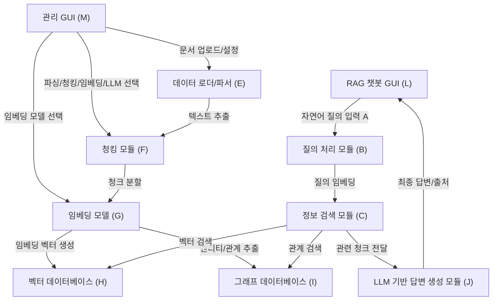

## Retrieval-Augmented Generation (RAG)

RAG 의 개념에 대해서는 잘 설명된 것이 있으니 링크로 대체.  
이 문서들은 각 LLM 들의 Deep Research 를 활용하여 자료를 수집하고 이해한 것을 기억에 남기기 위해 재구성하였다.  
따라서 포맷도 글 스타일도 일관성은 없을 것이다.

https://aws.amazon.com/ko/what-is/retrieval-augmented-generation/

https://www.elastic.co/kr/what-is/retrieval-augmented-generation

RAG는 대규모 언어 모델(LLM)과 검색 기술을 결합하여 실시간으로 정확하고 맥락에 맞는 답변을 생성하는 기술입니다.  
RAG는 데이터 준비 단계와 실시간 질의응답 단계로 구성됩니다.  
RAG는 데이터 준비 단계에서 데이터를 처리하고, 실시간 질의응답 단계에서 사용자의 질문에 대한 답변을 생성합니다.  
RAG의 데이터 준비 단계는 텍스트 추출, 청킹, 벡터 임베딩 생성 및 데이터베이스 저장으로 구성되며, 실시간 질의응답 단계는 사용자 질문 처리, 관련 정보 검색 및 LLM을 활용한 답변 생성으로 이루어집니다.  
RAG의 데이터 준비 단계와 실시간 질의응답 단계는 상호 보완적으로 작동하여, 사용자가 필요로 하는 정보를 신속하고 정확하게 제공합니다.
RAG는 이러한 과정을 통해 사용자가 필요로 하는 정보를 제공하며, 다양한 응용 분야에서 활용될 수 있습니다.  
......는 IDE에서 그냥 오토 컴플릿으로 생성한 문구이다.

RAG 구현을 위해 다음과 같은 단계를 거칠 예정이다.  
먼저 RAG 시스템 구현은 이미 좋은 구조가 널리 알려져 있다. AWS, GCP, Azure와 같은 클라우드 플랫폼에서도 이를 지원한다.  
다만 어떻게 구현할지에 따라 성능과 효율성이 크게 달라질 수 있다.  
그리고 학습하는 입장에서는 어떤식으로 해야 효율적일지도 생각해야 한다.  

1. 이미 잘 알려진 구조를 참고하여 기본적인 RAG 시스템을 이용하여 시스템을 구성한다. 각 클라우드 회사에서는 기본적인 템플릿들을 제공한다. 이것은 RAG 의 기본 요소를 이해하기 위함이다.
2. 몇가지 컴포넌트를 내가 원하는 것으로 변경해본다. 
3. RAG 시스템의 성능을 테스트하고, 결과를 분석하여 끊임없이 성능 개선이 가능한 시스템 구현

## RAG 데이터 추츨을 위한 단계

RAG 은 데이터를 준비하는 것이 첫 단계라 할 수 있다.  
이를 위해서 다양한 데이터 소스에서 정보를 추출하고, 이를 처리 및 변환하여 활용 가능한 형태로 준비해야 한다.  
소스에서 데이터를 추출 하는 것을 파싱이라 하고, 파싱된 결과를 가지고 LLM 에서 사용하기 좋은 단위로 다시 나누는 것을 청킹이라 한다.

* 파싱 (Parsing)  
  * 텍스트 정제: 추출된 텍스트에서 불필요한 공백, 제어 문자, 특수 문자 등을 제거하여 데이터의 노이즈를 줄입니다.10 HTML 태그나 마크다운 문법이 포함된 경우, 이를 제거하거나 텍스트로 변환하는 과정이 필요할 수 있습니다.  
  * 한국어 문서 처리: 한국어 문서의 경우, 의미 단위의 정확한 분석과 처리를 위해 형태소 분석기를 적용하는 것을 고려할 수 있습니다. Mecab-ko, KoNLPy (Okt, Kkma 등 포함)와 같은 라이브러리를 사용하여 명사, 동사 등 주요 품사를 추출하거나, 불용어를 제거하는 등의 전처리를 수행할 수 있습니다. 사용자가 GUI를 통해 형태소 분석기 적용 여부나 특정 분석기 라이브러리를 선택할 수 있도록 유연성을 제공하는 것이 좋습니다.  

* 청킹 (Chunking)
  * 정제된 텍스트를 임베딩 모델과 LLM의 컨텍스트 윈도우 크기를 고려하여 적절한 크기의 조각(청크)으로 나누는 과정입니다. 효과적인 청킹은 검색 정확도와 LLM의 답변 품질에 직접적인 영향을 미칩니다.
  * 청킹 전략 선택: 사용 사례와 데이터 특성에 따라 적합한 청킹 전략을 선택합니다
    * 고정 크기 청킹 (Fixed-size Chunking): 가장 간단한 방식으로, 텍스트를 지정된 문자 수 또는 토큰 수로 자릅니다. 구현이 쉽지만, 문맥이 중간에 끊어질 위험이 있습니다.
    * 재귀적 문자 분할 (Recursive Character Text Splitting): Langchain에서 제공하는 방식으로, 문단(\n\n), 문장(.), 공백() 등 지정된 구분자 목록을 순차적으로 시도하며 텍스트를 분할합니다. 의미론적 경계를 최대한 유지하려는 시도입니다.
    * 의미 기반 청킹 (Semantic Chunking): 문장이나 작은 텍스트 조각들의 임베딩 유사도를 기반으로 의미적으로 유사한 부분들을 하나의 청크로 묶습니다. 문맥적 일관성을 높이는 데 효과적일 수 있으나, 계산 비용이 더 들 수 있습니다.
    * 문서 구조 기반 청킹 (Document-specific Chunking): Markdown의 제목, HTML 태그, 코드의 함수/클래스 정의 등 문서 자체의 구조적 요소를 활용하여 청크를 나눕니다. 문서의 논리적 흐름을 유지하는 데 유리합니다.

## 주요 구성 및 데이터 흐름 요소

1. 사용자 인터페이스 (GUI)
   1. 관리 GUI (M): 사용자는 이 인터페이스를 통해 원본 문서(D)를 업로드하고, 파싱/청킹 전략(F), 임베딩 모델(G), 사용할 LLM(K) 등을 선택 및 설정합니다. 모니터링과 모델 관리등 시스템 전반적인 관리 모듈이 추가되야 합니다.
   2. RAG 챗봇 GUI (L): 사용자는 이 인터페이스를 통해 시스템에 자연어 질의(A)를 입력하고, RAG 파이프라인을 통해 생성된 답변과 그 출처를 받습니다. 
2. 데이터 준비 파이프라인
   1. 데이터 로더/파서 (E): 업로드된 다양한 형식의 문서를 로드하고 텍스트를 추출합니다.
   2. 청킹 모듈 (F): 추출된 텍스트를 의미 있는 단위의 청크(Chunk)로 분할합니다. 사용자가 선택한 전략과 파라미터를 따릅니다.
   3. 임베딩 모델 (G): 분할된 텍스트 청크를 고차원 벡터로 변환(임베딩)합니다. 사용자가 선택한 모델(Hugging Face, Ollama, OpenAI API 등)을 사용합니다.
   4. 벡터 데이터베이스 (H): 생성된 임베딩 벡터와 원본 청크 정보를 저장하고, 유사도 기반 검색을 지원합니다.
   5. 그래프 데이터베이스 (I) (선택적 확장): 문서 내/간 엔티티 및 관계 정보를 저장하여, 보다 심층적인 컨텍스트 검색을 지원합니다.
3. 실시간 질의응답 파이프라인
   1.  질의 처리 모듈 (B): 사용자 질의(A)를 분석하고, 필요한 경우 질의를 재작성(Rewriting)하거나 확장(Expansion)한 후, 선택된 임베딩 모델을 사용하여 벡터로 변환합니다.
   2. 정보 검색 모듈 (C): 변환된 질의 벡터를 사용하여 벡터 데이터베이스(H)에서 유사한 청크들을 검색합니다. 필요한 경우 그래프 데이터베이스(I)를 활용하여 추가적인 관계 정보를 검색합니다 (Hybrid Search). 검색된 정보는 관련도에 따라 순위가 매겨지고 필터링됩니다.
   3. LLM 기반 답변 생성 모듈 (J): 검색된 컨텍스트 정보와 사용자 질의를 바탕으로, 사용자가 선택한 LLM(K)을 사용하여 최종 답변을 생성합니다. 이 과정에서 효과적인 프롬프트 엔지니어링이 적용됩니다. 생성된 답변은 출처 정보와 함께 사용자 인터페이스(L)로 전달됩니다.
    

## 청킹

1. 토크나이저 이용
2. LLM 이용
3. ** PLM Based(Fine-tuning) ** : T5 와 같은 모델로부터 학습하도록 한 후 임계값으로 조절. Langchain 의 Semantic Chunker 업글판.
4. 합성 데이터 방식. QA, Antrophic Context Retrieval, RAPTOR
