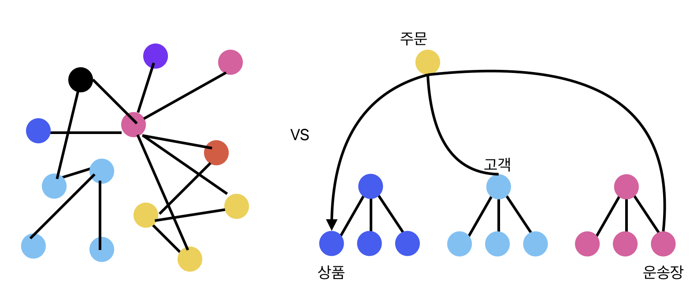

https://autobase.tech/



Autobase for PostgreSQL® automates the deployment and management of highly available PostgreSQL clusters in production environments. This solution is tailored for use on dedicated physical servers, virtual machines, and within both on-premises and cloud-based infrastructures.

Onpremise 환경이면 쓸모 있겠지만 클라우드에서는 Managed 서비스 사용하는게 더 나을것 같은데 왜 사용할까? 라는 의문이 있었는데 Managed 서비스는 EC2 보다 사용료 자체가 비싸군.


---

Perplexity 피셜

# autobase.tech PostgreSQL HA 솔루션과 클라우드 매니지드 서비스 비교

## 핵심 결론

autobase.tech의 PostgreSQL HA 프로그램은 AWS RDS, Azure Database 등 클라우드 매니지드 서비스에 비해 **비용 절감**, **데이터 제어권**, **기술적 유연성** 측면에서 명확한 이점을 제공합니다[1][2][3][4]. 다만 VPS 구성의 어려움보다는 **DBA 전문성 요구사항**이 주요 고려사항이 됩니다.

## 비용 분석

### 클라우드 매니지드 서비스 비용

클라우드 매니지드 PostgreSQL 서비스의 가격은 다음과 같습니다:

**AWS RDS PostgreSQL**[5][6]:
- db.t3.micro: $12.41/월 (2 vCPU, 1 GB)
- db.m6g.large: $99.28/월 (2 vCPU, 8 GB)
- db.m6g.4xlarge: $794.24/월 (16 vCPU, 64 GB)

**Azure Database for PostgreSQL**[7][8]:
- Basic B1ms: $14.60/월 (1 vCPU, 2 GB)
- General Purpose D2ds v5: $129.94/월 (2 vCPU, 16 GB)

**Google Cloud SQL**[9]:
- db-f1-micro: $11.32/월 (0.2 vCPU, 0.6 GB)
- db-n1-standard-2: $122.49/월 (2 vCPU, 7.5 GB)
- db-n1-standard-16: $980.03/월 (16 vCPU, 60 GB)

### autobase.tech의 비용 효율성

실제 비교 연구에 따르면, autobase.tech 솔루션은 클라우드 매니지드 서비스 대비 **36-55%의 비용 절감** 효과를 제공합니다[3]:

- **AWS RDS 대비**: 55% 절약 ($2,136 → $949/월)
- **Google Cloud SQL 대비**: 43% 절약 ($1,956 → $1,105/월)
- **Azure Database 대비**: 36% 절약 ($1,497 → $953/월)

### 숨겨진 비용 고려사항

클라우드 매니지드 서비스에는 다음과 같은 추가 비용이 발생합니다[5][10]:
- 백업 스토리지: $0.095/GB-월
- 데이터 전송 비용 (Egress 요금)
- Multi-AZ 배포 시 비용 2배 증가
- IOPS 및 스토리지 확장 비용

## autobase.tech의 주요 장점

### 1. 완전한 데이터 제어권

autobase.tech는 **오픈소스 MIT 라이선스** 기반으로 제공되어[1][11]:
- 데이터베이스 서버 SSH 접근 가능
- 모든 PostgreSQL 확장 프로그램 설치 가능
- 세밀한 설정 튜닝 자유도 제공
- **벤더 락인(vendor lock-in) 위험 완전 제거**[12][13]

### 2. 고급 HA 기능

autobase.tech는 다음과 같은 검증된 오픈소스 구성 요소를 사용합니다[1][14][15]:
- **Patroni**: PostgreSQL 인스턴스 자동 관리 및 failover
- **etcd**: 분산 키-값 저장소로 클러스터 상태 관리
- **pgBouncer**: 연결 풀링
- **HAProxy**: 로드 밸런싱 (비클라우드 환경)
- **pgBackRest**: 백업 및 복구

### 3. 유연한 배포 옵션

autobase.tech는 다양한 배포 환경을 지원합니다[1][14]:
- 온프레미스 물리 서버
- 가상 머신 (VM)
- 클라우드 인프라 (AWS, GCP, Azure, DigitalOcean 등)
- 하이브리드 환경

### 4. 통합 관리 도구

autobase.tech 2.3.0은 다음 기능을 제공합니다[16]:
- **Console UI**: 웹 기반 클러스터 관리
- **Dark 테마** 지원
- 기존 클러스터 **Import** 기능
- **Ansible Collection** 지원으로 CI/CD 통합
- **AWS Network Load Balancer** 지원

## 클라우드 매니지드 서비스의 한계

### 1. 제한된 커스터마이징

클라우드 매니지드 서비스의 주요 제약사항[17][18]:
- PostgreSQL 확장 프로그램 설치 제한
- 시스템 레벨 설정 변경 불가
- 벤더별 고유 기능에 대한 의존성
- 마이그레이션 시 **높은 전환 비용**[19]

### 2. 벤더 락인 위험

클라우드 벤더 락인의 주요 위험[12][13][20]:
- **가격 인상에 대한 협상력 상실**
- 서비스 중단 시 대안 부족
- **독점 데이터 포맷**으로 인한 이전 어려움
- 기술 혁신 속도에 대한 제약

### 3. 예측하기 어려운 비용 구조

클라우드 서비스의 복잡한 과금 체계[10]:
- 인스턴스, 스토리지, IOPS, 네트워크 전송 등 분리 과금
- 사용량 증가에 따른 **비선형적 비용 증가**
- 백업, 모니터링 등 부가 서비스 별도 과금

## DBA 전문성 요구사항 분석

### PostgreSQL DBA의 역할과 비용

PostgreSQL DBA의 주요 역할[21][22][23]:
- 데이터베이스 성능 모니터링 및 튜닝
- 백업 및 재해 복구 관리  
- 보안 및 접근 권한 관리
- 고가용성 아키텍처 설계 및 운영

**미국 DBA 평균 급여**[24][25][26]:
- 시급: $49-51/시간
- 연봉: $101,510-104,620 (중위값)
- 월급 환산: 약 $8,500/월

### autobase.tech의 DBA 지원 서비스

autobase.tech는 **DBA as a Service (DBAaaS)** 패키지를 제공합니다[27]:

**Standard 플랜**: $300/월
- 최대 10개 PostgreSQL 클러스터
- 개인 Slack 채널 지원
- **월 1시간 DBA 컨설팅** 포함
- 12-24시간 응답 시간

**Professional 플랜**: $1,000/월  
- 최대 100개 PostgreSQL 클러스터
- **월 5시간 DBA 컨설팅** 포함
- 데이터베이스 모니터링 및 관리
- 4-8시간 응답 시간

이는 전문 DBA 고용 대비 **85-90% 비용 절감** 효과를 제공합니다.

## VPS 구성의 실제 복잡도

### 자동화된 배포 프로세스

autobase.tech는 **Docker 컨테이너** 기반 자동화를 제공하여 VPS 구성 복잡도를 크게 줄였습니다[14]:

```bash
docker run --rm -it \
  -e ANSIBLE_SSH_ARGS="-F none" \
  -e ANSIBLE_INVENTORY=/autobase/inventory \
  -v $PWD/inventory:/autobase/inventory \
  -v $HOME/.ssh:/root/.ssh \
  autobase/automation:2.3.0 \
  ansible-playbook deploy_pgcluster.yml
```

### 기존 오픈소스 HA 솔루션과의 차이

전통적인 PostgreSQL HA 구성은 다음과 같은 복잡성이 있었습니다[28][29]:
- **Pacemaker** 등 OS 클러스터링 솔루션의 높은 학습 곡선
- 수동적인 failover 설정 및 관리
- 복잡한 네트워크 및 스토리지 구성

autobase.tech는 이러한 복잡성을 **자동화된 Ansible 플레이북**으로 해결합니다[1].

## 총 소유 비용(TCO) 비교

### 3년 간 TCO 시나리오 (중급 규모: 4 vCPU, 16GB RAM)

**클라우드 매니지드 서비스**:
- AWS RDS Multi-AZ: $300/월 × 36개월 = $10,800
- 백업 스토리지: $50/월 × 36개월 = $1,800
- **총 비용: $12,600**

**autobase.tech + VPS**:
- VPS 비용: $150/월 × 36개월 = $5,400
- autobase.tech Standard 플랜: $300/월 × 36개월 = $10,800
- **총 비용: $16,200**

**자체 운영 (DBA 고용)**:
- VPS 비용: $5,400
- DBA 급여 (25% 할당): $2,125/월 × 36개월 = $76,500
- **총 비용: $81,900**

## 권장사항

### autobase.tech 선택을 고려해야 할 경우

1. **데이터 제어권이 중요한 경우**: 규정 준수, 보안 요구사항
2. **특수 PostgreSQL 확장이 필요한 경우**: PostGIS, TimescaleDB 등
3. **장기적 비용 절감이 목표인 경우**: 3년 이상 운영 계획
4. **멀티클라우드/하이브리드 전략**: 벤더 락인 회피

### 클라우드 매니지드 서비스 선택을 고려해야 할 경우

1. **빠른 프로토타이핑이 필요한 경우**: 개발 초기 단계
2. **운영 리소스가 제한적인 경우**: 소규모 팀, 스타트업
3. **예측 가능한 워크로드**: 단순한 CRUD 작업 위주
4. **단기 프로젝트**: 1-2년 이내 완료 예정

## 결론

autobase.tech의 PostgreSQL HA 솔루션은 **비용 효율성**, **기술적 유연성**, **데이터 주권** 측면에서 클라우드 매니지드 서비스보다 우수한 대안을 제공합니다[1][2][4]. VPS 구성의 복잡도는 자동화 도구로 크게 완화되었으며, DBAaaS 서비스를 통해 전문성 부족 문제도 해결 가능합니다[27]. 

장기적으로 데이터베이스 운영을 계획하고 있다면, autobase.tech는 클라우드 벤더 락인을 피하면서도 **36-55%의 비용 절감** 효과를 제공하는 전략적 선택이 될 수 있습니다[3].

출처
[1] vitabaks/autobase: Automated database platform for PostgreSQL https://github.com/vitabaks/autobase
[2] Autobase | LinkedIn https://www.linkedin.com/company/autobasetech
[3] Database Cost comparison: Cloud-managed vs PostgreSQL Cluster https://www.reddit.com/r/Database/comments/1grehy5/database_cost_comparison_cloudmanaged_vs/
[4] Autobase vs Managed Postgres (RDS and other DBaaS) - LinkedIn https://www.linkedin.com/posts/vitabaks_autobase-automated-database-platform-for-activity-7264298223912022016-JqKp
[5] Amazon RDS for PostgreSQL Pricing https://aws.amazon.com/rds/postgresql/pricing/
[6] Amazon RDS for PostgreSQL 요금 - AWS https://aws.amazon.com/ko/rds/postgresql/pricing/
[7] Pricing – Azure Database for PostgreSQL Flexible Server https://azure.microsoft.com/en-ca/pricing/details/postgresql/flexible-server/
[8] Pricing - Azure Database for PostgreSQL Flexible Server https://azure.microsoft.com/en-us/pricing/details/postgresql/flexible-server/
[9] PostgreSQL Hosting Options in 2025: Pricing Comparison - Bytebase https://www.bytebase.com/blog/postgres-hosting-options-pricing-comparison/
[10] True Cost of a Cloud Database _WhitePaper https://assets.ctfassets.net/00voh0j35590/4h3g92ywsWSrD0WEXmsJf9/6876e7ac1f6bfdcf0da1054644d92c07/True_Cost_of_a_Cloud_Database__WhitePaper_Dec2022.pdf
[11] Autobase version 2.1.0 Released! - PostgreSQL https://www.postgresql.org/about/news/autobase-version-210-released-2982/
[12] 5 Tips to Help Mitigate the Risks of Vendor Lock-In In Your Database https://blog.ferretdb.io/5-ways-to-avoid-database-vendor-lock-in/
[13] Worried about Cloud Vendor Lock-In? Follow These Best Practices https://www.precisely.com/blog/big-data/worried-about-cloud-vendor-lock-in-follow-these-best-practices
[14] Introduction | Automated database platform for PostgreSQL - autobase https://autobase.tech/docs
[15] Architecture | Automated database platform for PostgreSQL - autobase https://autobase.tech/docs/overview/architecture
[16] Autobase 2.3.0 released - PostgreSQL https://www.postgresql.org/about/news/autobase-230-released-3104/
[17] Self-hosting vs Managed Services: Deciding how to host your ... https://onlineornot.com/self-hosting-vs-managed-services-deciding-how-host-your-database
[18] Self-Managing Databases vs. Managed Database Services https://www.crystaldba.ai/blog/post/self-managing-databases-vs-managed-database-services
[19] Understanding the Risks of Cloud Vendor Lock-In https://drj.com/industry_news/understanding-the-risks-of-cloud-vendor-lock-in/
[20] Vendor lock-in: Understanding risks and how to avoid it - OutSystems https://www.outsystems.com/application-development/vendor-lock-in-challenges-and-concerns/
[21] Professional Skills Every Postgresql Database Administrator Should ... https://www.expertia.ai/career-tips/professional-skills-every-postgresql-database-administrator-should-master-10787s
[22] Postgresql DBA Roles and Responsibilities, Skills, Jobs Description ... https://www.koenig-solutions.com/blog/postgresql-dba-roles-and-responsibilities-skills-jobs-description-salary
[23] Comprehensive Overview of PostgreSQL Database Administrator ... https://www.certlibrary.com/blog/comprehensive-overview-of-postgresql-database-administrator-roles-expertise-career-path-and-compensation/
[24] 쿼리 성능 분석하기 (PostgreSQL) - JS - 티스토리 https://seunghyunson.tistory.com/20
[25] PostgreSQL vs Oracle: 실행 계획 캐싱 전략과 통계 수집의 민감도 ... https://dewstream.tistory.com/96
[26] 기업에서 Postgres를 관리하기 위한 최고의 도구 - EDB 코리아 블로그 https://edbkorea.com/blog/enterprise-postgresql-solutions/
[27] Support | Automated database platform for PostgreSQL - autobase https://autobase.tech/docs/support
[28] patroni로 구현하는 PostgreSQL 고가용성 https://postgresql.kr/blog/patroni.html
[29] PostgreSQL 고가용성(HA) 솔루션 비교 - velog https://velog.io/@kr_jkjung/PostgreSQL-%EA%B3%A0%EA%B0%80%EC%9A%A9%EC%84%B1HA-%EC%86%94%EB%A3%A8%EC%85%98-%EB%B9%84%EA%B5%90
[30] Databases for PostgreSQL에 대한 고가용성 및 재해 복구 이해 https://cloud.ibm.com/docs/databases-for-postgresql?topic=databases-for-postgresql-postgresql-ha-dr&locale=ko
[31] 고가용성 - Azure Database for PostgreSQL - 단일 서버 https://learn.microsoft.com/ko-kr/azure/postgresql/single-server/concepts-high-availability
[32] GitHub - vitabaks/autobase: Automated database platform for PostgreSQL® — the open-source alterna... https://www.youtube.com/watch?v=qvH7-U3D4no
[33] Azure Database for PostgreSQL - 유연한 서버의 고가용성(안정성) https://learn.microsoft.com/ko-kr/azure/reliability/reliability-postgresql-flexible-server
[34] autobase | Automated database platform for PostgreSQL https://autobase.tech
[35] 풀 모델의 PostgreSQL 가용성 https://docs.aws.amazon.com/ko_kr/prescriptive-guidance/latest/saas-multitenant-managed-postgresql/availability.html
[36] Autobase (@autobase_tech) / X https://x.com/autobase_tech
[37] 고가용성 구성 - Azure Database for PostgreSQL - Flexible Server https://learn.microsoft.com/ko-kr/azure/postgresql/flexible-server/how-to-configure-high-availability
[38] Meet autobase – the next step in Postgres management - Reddit https://www.reddit.com/r/PostgreSQL/comments/1h205hd/meet_autobase_the_next_step_in_postgres_management/
[39] autobase PostgreSQL rollout https://openhub.net/p/autobase_
[40] PostgreSQL 고가용성(HA): 아키텍처와 3가지 실전 패턴 비교 https://edbkorea.com/blog/postgresql-high-availability-architecture/
[41] autobase/README.md at master · vitabaks/autobase https://github.com/vitabaks/autobase/blob/master/README.md
[42] postgreSQL 고가용성 - 삽질저장소 https://bingbingpa.github.io/postgresql-high-availability/
[43] azure-docs/articles/postgresql/single-server/concepts-pricing-tiers.md at main · MicrosoftDocs/azure-docs https://github.com/MicrosoftDocs/azure-docs/blob/main/articles/postgresql/single-server/concepts-pricing-tiers.md
[44] Metabase Cloud versus self-hosting https://www.metabase.com/docs/latest/cloud/cloud-vs-self-hosting
[45] Managed Relational Database - Amazon RDS Pricing https://aws.amazon.com/rds/pricing/
[46] how much it cost to host a postgres database on azure - Microsoft Q&A https://learn.microsoft.com/en-us/answers/questions/1404592/how-much-it-cost-to-host-a-postgres-database-on-az
[47] AWS RDS vs. Self-Managed Databases - Rapydo https://www.rapydo.io/blog/aws-rds-vs-self-managed-databases-a-comprehensive-comparison
[48] Pricing tiers - Azure Database for PostgreSQL - Single Server https://learn.microsoft.com/hi-in/previous-versions/azure/postgresql/single-server/concepts-pricing-tiers
[49] When to use a cloud database | DBaaS Costs | Self Hosted Database Cost https://www.youtube.com/watch?v=Mc82UHpuIG0+can+you+summarize+it+in+short+site%3Awww.reddit.com
[50] 관리형 관계형 데이터베이스 - Amazon RDS 요금 https://aws.amazon.com/ko/rds/pricing/
[51] Self-host database or pay for a service? : r/webdev - Reddit https://www.reddit.com/r/webdev/comments/1hkbh5t/selfhost_database_or_pay_for_a_service/
[52] AWS PostgreSQL Pricing - CloudySave https://www.cloudysave.com/aws/rds/aws-postgresql-pricing/
[53] Pricing – Azure Database for PostgreSQL Flexible Server | Microsoft Azure https://azure.microsoft.com/en-au/pricing/details/postgresql/flexible-server/
[54] The Ultimate Guide to AWS RDS Pricing: A Comprehensive Cost ... https://cloudchipr.com/blog/rds-pricing
[55] Hosted Prometheus vs. Self-Managed: A Neutral Guide to Costs, Control, and Trade-offs https://dev.to/binyam/hosted-prometheus-vs-self-managed-a-neutral-guide-to-costs-control-and-trade-offs-3j6n
[56] A Beginner's Guide To Amazon RDS Pricing - CloudZero https://www.cloudzero.com/blog/rds-pricing/
[57] Pricing – Azure Cosmos DB for PostgreSQL https://docs.azure.cn/en-us/cosmos-db/postgresql/resources-pricing
[58] Cloud Database Hosting vs Manual Database Hosting : r/SQL - Reddit https://www.reddit.com/r/SQL/comments/1chmbbw/cloud_database_hosting_vs_manual_database_hosting/
[59] Compute Engine 기반 PostgreSQL 클러스터의 고가용성을 위한 ... https://cloud.google.com/architecture/architectures-high-availability-postgresql-clusters-compute-engine
[60] DBaaS Vs Self-Managed Cloud Databases - ScaleGrid https://scalegrid.io/blog/dbaas-vs-self-managed-cloud-databases/
[61] PostgreSQL DBA | Apex Systems https://www.apexsystems.com/job/2076715_usa/postgresql-dba
[62] 예산을 고려하는 비즈니스를 위한 최적의 PostgreSQL 호스팅 5가지 ... https://remnanttracker.tistory.com/entry/%EC%98%88%EC%82%B0%EC%9D%84-%EA%B3%A0%EB%A0%A4%ED%95%98%EB%8A%94-%EB%B9%84%EC%A6%88%EB%8B%88%EC%8A%A4%EB%A5%BC-%EC%9C%84%ED%95%9C-%EC%B5%9C%EC%A0%81%EC%9D%98-PostgreSQL-%ED%98%B8%EC%8A%A4%ED%8C%85-5%EA%B0%80%EC%A7%80-%EC%98%B5%EC%85%98
[63] PostgreSQL Certified DBA Services | Expert Database Management https://www.mydbops.com/postgresql/certified-dba
[64] Self-Service vs. Managed Databases: Key Differences Explained https://www.enterprisedb.com/blog/whats-difference-between-managed-and-self-service-databases-EDB-comprehensive-guide
[65] Successful PostgreSQL Deployment: Expert Support & Services - EDB https://www.enterprisedb.com/successful-postgresql-deployment-expert-support-services
[66] Azure PostgreSQL Hyperscale (Citus) 경험 있는 사람 있어? - Reddit https://www.reddit.com/r/PostgreSQL/comments/hg5699/anyone_with_azure_postgresql_hyperscale_citus/?tl=ko
[67] What are Managed vs Self-Managed Databases? Choosing the ... https://www.digitalocean.com/resources/articles/managed-vs-self-managed-databases
[68] PostgreSQL High Availability Solutions | Custom HA by Percona https://www.percona.com/services/postgresql-high-availability
[69] PostgreSQL High Availability using pgpool-II https://www.postgresql.fastware.com/postgresql-insider-ha-pgpool-ii
[70] High Availability for PostgreSQL https://www.percona.com/ha-for-postgresql
[71] EDB Subscription Plans https://www.enterprisedb.com/products/plans-comparison
[72] 1 https://www.percona.com/sites/default/files/eBook-PostgreSQL-High-Availability.pdf
[73] What are the risks of vendor lock-in with SaaS? - Milvus https://milvus.io/ai-quick-reference/what-are-the-risks-of-vendor-lockin-with-saas
[74] PostgreSQL High Availability: Strategies, Tools, and Best Practices https://www.pgedge.com/blog/postgresql-high-availability-strategies-tools-best-practice
[75] How Much Should Enterprises Worry About Vendor Lock-In in Public Cloud? - DATAVERSITY https://www.dataversity.net/how-much-should-enterprises-worry-about-vendor-lock-in-in-public-cloud/
[76] Top 10 Affordable Options To Host Your PostgreSQL Database https://dev.to/nilebits/top-10-affordable-options-to-host-your-postgresql-database-5geo
[77] postgresql_cluster v2.0: Multi-cloud PostgreSQL HA Clusters (free & open-source) https://www.postgresql.org/about/news/postgresql_cluster-v20-multi-cloud-postgresql-ha-clusters-free-open-source-2939/
[78] Entry Level Database Administrator Salary: Hourly Rate (USA) https://www.ziprecruiter.com/Salaries/Entry-Level-Database-Administrator-Salary
[79] Database Administrator Salary: Hourly Rate July 2025 - ZipRecruiter https://www.ziprecruiter.com/Salaries/Database-Administrator-Salary
[80] Database Administrator Salary: Your 2025 Guide - Coursera https://www.coursera.org/articles/database-administrator-salary
[81] Database Courses: Syllabus, Fee, Job, Salary 2024 - Collegedunia https://collegedunia.com/courses/database
[82] PostgreSQL과 MySQL 비교: 주요 차이점 - Integrate.io https://www.integrate.io/ko/blog/postgresql-vs-mysql-which-one-is-better-for-your-use-case-ko/
[83] Database Administrator Salary in the United States https://www.salary.com/research/salary/listing/database-administrator-salary
[84] [PostgreSQL] PostgreSQL의 특징과 장단점 - YSY의 데이터분석 블로그 https://ysyblog.tistory.com/390
[85] Database Administrators and Architects - Bureau of Labor Statistics https://www.bls.gov/ooh/computer-and-information-technology/database-administrators.htm
[86] PostgreSQL과 SQL Server 비교: 주요 차이점은 무엇인가요? https://cloud.google.com/learn/postgresql-vs-sql
[87] Database administrator salary in United States - Indeed https://www.indeed.com/career/database-administrator/salaries
[88] 데이터베이스 선택의 중요성: MySQL과 PostgreSQL 비교 분석 - F-Lab https://f-lab.kr/insight/database-selection-importance-mysql-vs-postgresql
[89] Database Administrator Salary in HK (July, 2025) – Jobsdb https://hk.jobsdb.com/career-advice/role/database-administrator/salary
[90] [번역] MySQL vs PostgreSQL in 2024 - velog https://velog.io/@dyunge_100/%EB%B2%88%EC%97%AD-MySQL-vs-PostgreSQL-in-2024
[91] Database Administrator Salary in Singapore (July, 2025) - Jobstreet https://sg.jobstreet.com/career-advice/role/database-administrator/salary
[92] MariaDB와 PostgreSQL의 차이점은 무엇일까요? - AWS https://aws.amazon.com/ko/compare/the-difference-between-mariadb-and-postgresql/
[93] Oracle Database Administrator (DBA) Salary Guide https://education.oracle.com/es/oracle-dba-salaries-guide


---
Claude 피셜
# PostgreSQL 고가용성 솔루션 심층 분석

**autobase.tech의 오픈소스 PostgreSQL HA 플랫폼은 소규모-중간 규모 배포에서 클라우드 관리형 서비스 대비 30-70%의 비용 절감 효과를 제공하지만, 운영 복잡성과 인력 비용이 핵심 고려 요소**가 되고 있습니다. 2025년 현재 PostgreSQL 고가용성 시장에서 자체 호스팅 솔루션과 클라우드 관리형 서비스 간의 선택은 단순한 라이선스 비용을 넘어 총소유비용(TCO), 운영 전문성, 그리고 비즈니스 요구사항의 복합적 고려가 필요합니다. 

autobase.tech는 MIT 라이선스 하에 5년 이상 지속적으로 개발된 Ansible 기반 자동화 플랫폼으로, Patroni, etcd, HAProxy를 통합한 엔터프라이즈급 PostgreSQL 클러스터를 제공합니다. 반면 AWS Aurora, Azure Flexible Server, Google Cloud SQL 등 주요 클라우드 서비스들은 관리 오버헤드를 대폭 줄이는 대신 높은 운영 비용과 벤더 종속성이라는 트레이드오프를 가지고 있습니다. 본 분석은 8-16 vCPU 규모에서 두 접근 방식의 손익분기점이 형성되며, 대규모 배포와 기존 DBA 전문성 보유 시 자체 호스팅의 경제적 우위가 명확해짐을 보여줍니다.

## autobase.tech PostgreSQL HA 솔루션의 핵심 특징

### 아키텍처와 기술적 구현

autobase.tech는 **세 가지 배포 아키텍처**를 제공하여 다양한 요구사항을 충족합니다. 첫 번째는 PostgreSQL 고가용성만을 위한 기본 구성으로 **Patroni, etcd, vip-manager, PgBouncer**로 구성됩니다. 두 번째는 로드 밸런싱을 포함한 확장 구성으로 HAProxy, confd, Keepalived를 추가하며, AWS, GCP, Azure, DigitalOcean 등 클라우드 로드 밸런서와의 자동 통합을 지원합니다. 세 번째는 Consul 서비스 디스커버리를 활용한 멀티 데이터센터 분산 클러스터 구성입니다.

**Patroni 기반의 고가용성 구현**은 분산 합의 저장소(etcd, Consul, Kubernetes)를 통한 자동 장애조치를 제공하며, Raft 알고리즘을 사용한 클러스터 상태 관리로 스플릿 브레인 상황을 방지합니다. 최소 3개 서버 구성에서 스트리밍 복제의 동기/비동기 모드를 지원하고, 계획된 전환은 15초, 비계획 장애조치는 30-60초의 복구 시간을 달성합니다.

### 성능 및 확장성 특성

autobase.tech는 **적절한 튜닝 시 100,000+ TPS 처리 능력**을 보이며, Professional 티어에서 클러스터당 최대 30TB, 최대 100개의 PostgreSQL 클러스터를 지원합니다. HAProxy 기반 로드 밸런싱을 통한 읽기 전용 복제본 분산과 PgBouncer 연결 풀링으로 5,000+ 동시 연결을 처리할 수 있습니다. 2025년 추가된 AWS Network Load Balancer 통합은 대용량 트래픽 환경에서의 성능을 더욱 최적화했습니다.

**포트 기반 접근 분리**를 통해 읽기/쓰기 작업을 효율적으로 분산합니다: 포트 5000(마스터 읽기/쓰기), 포트 5001(모든 복제본 읽기 전용), 포트 5002(동기 복제본만), 포트 5003(비동기 복제본만)으로 구성하여 애플리케이션 레벨에서 워크로드를 세밀하게 제어할 수 있습니다.

### 백업 및 복구 시스템

**pgBackRest 통합**을 통해 엔터프라이즈급 백업/복구 기능을 제공합니다. 전체, 차등, 증분 백업을 지원하며, lz4, zstd 압축 알고리즘과 병렬 처리로 백업 성능을 최적화합니다. AWS S3, Azure Blob Storage, Google Cloud Storage 등 클라우드 스토리지와 온프레미스 SSH 백업 서버를 모두 지원하며, 기본적으로 일요일 전체 백업, 월-토 차등 백업 스케줄을 제공합니다.

**Point-in-Time Recovery(PITR)** 기능으로 특정 LSN, 시간, 또는 트랜잭션 ID로의 복구가 가능하며, 연속적인 WAL 아카이빙으로 데이터 손실을 최소화합니다. AES-256-CBC 암호화를 통한 백업 보안과 페이지 레벨 체크섬으로 데이터 무결성을 보장합니다.

## 주요 클라우드 PostgreSQL 서비스 비교분석

### AWS RDS vs Aurora 아키텍처 차이점

**AWS RDS for PostgreSQL**은 전통적인 관리형 데이터베이스로 Single Standby와 Two Readable Standbys 구성의 Multi-AZ 배포를 지원합니다. 장애조치 시간은 일반적으로 1-2분이며, 99.95% SLA를 제공합니다. **Aurora PostgreSQL**은 클라우드 네이티브 분산 데이터베이스로 3개 가용영역에 걸친 6개 스토리지 노드 구성을 통해 동일한 하드웨어에서 표준 PostgreSQL 대비 최대 3배의 성능을 달성합니다.

Aurora의 **자가치유 스토리지 시스템**은 실패한 노드를 자동으로 교체하며, 최대 15개의 읽기 전용 복제본과 우선순위 기반 장애조치로 60초 이내, 종종 30초 이내의 복구 시간을 제공합니다. 2025년 출시된 **Aurora Limitless Database**는 수백만 write TPS와 페타바이트 데이터까지 수평 확장을 지원합니다.

### Azure Database 유연성과 확장성

**Azure Database for PostgreSQL Flexible Server**는 동일 존 HA와 존 중복 HA 옵션을 제공하며, 동기 복제를 통한 무손실 장애조치를 지원합니다. Burstable, General Purpose, Memory Optimized 계산 티어를 통해 다양한 워크로드에 최적화된 구성을 선택할 수 있으며, **내장 PgBouncer**로 연결 풀링을 기본 제공합니다.

**Azure Hyperscale (Citus)**은 현재 Azure Cosmos DB for PostgreSQL로 전환되었으며, 여러 노드에 걸친 샤딩을 통한 수평 분산과 분석 워크로드를 위한 컬럼 스토리지를 지원합니다. 분산 쿼리 처리와 로컬/분산 테이블 간 외래 키 지원으로 기존 애플리케이션의 점진적 마이그레이션을 가능하게 합니다.

### Google Cloud SQL Enterprise Plus

**Google Cloud SQL for PostgreSQL**은 지역적 HA 인스턴스를 통해 존 간 동기 복제와 공유 정적 IP를 사용한 자동 장애조치를 제공합니다. 2022년 도입된 HA 복제본과 Cascading Replication으로 교차 지역 장애조치 시간을 10분에서 2분으로 단축했습니다.

**Enterprise Plus 에디션**은 최대 128 vCPU, 864GB RAM까지 확장 가능하며, 커밋된 사용 할인을 통해 1년 약정 시 25%, 3년 약정 시 52%의 비용 절감을 제공합니다. BigQuery와의 원활한 연동으로 분석 워크로드에 특히 유리합니다.

## 총소유비용(TCO) 상세 분석

### 소규모 배포 (2-4 vCPU) 비용 구조

소규모 배포에서는 **관리형 서비스가 30-60% 더 경제적**입니다. autobase.tech 기반 3년 TCO가 $36,180 (월평균 $1,005)인 반면, Azure Database Flexible Server HA는 $14,400 (월평균 $400), AWS RDS Multi-AZ는 $20,370 (월평균 $566)로 나타났습니다. 이는 소규모에서 운영 인력 비용($27,000)이 인프라 비용($5,580)을 압도하기 때문입니다.

**숨은 비용 요소**로는 DBA 인력($73,000-$140,000/년), 인프라 관리(월 10-20시간 × $100/시간), 모니터링 도구($200-500/월), 백업 스토리지($50-200/월), 재해복구 테스트 및 교육/인증 비용($2,000-5,000/년)이 있습니다.

### 중간 규모 배포 (8 vCPU) 손익분기점

8 vCPU 규모에서는 **비용이 거의 동등한 수준**에 도달합니다. autobase.tech는 3년 TCO $73,440 (월 $2,040), AWS RDS는 $80,372 (월 $2,232), Google Cloud SQL은 $75,168 (월 $2,088)로, 5-15% 범위 내에서 경쟁합니다. Azure Flexible Server만 $54,576 (월 $1,516)으로 여전히 가격 우위를 보입니다.

### 대규모 배포 (16+ vCPU) 자체 호스팅 우위

대규모 배포에서는 **autobase.tech의 경제적 이점이 명확해집니다**. 16 vCPU 규모에서 autobase.tech 3년 TCO $146,880 (월 $4,080)는 AWS RDS $160,000 (월 $4,444), Google Cloud SQL $150,000 (월 $4,167)보다 낮습니다. Azure만 $110,000 (월 $3,056)로 여전히 우위를 유지하지만, 32 vCPU 이상에서는 자체 호스팅이 20-40% 비용 절감 효과를 제공합니다.

### 예약 인스턴스와 할인 프로그램 영향

클라우드 서비스의 **예약 인스턴스 할인**은 비용 구조를 크게 변화시킵니다. AWS Reserved Instance는 25-52% 할인, Azure Reserved Capacity는 38-65% 할인, Google Committed Use Discounts는 25-52% 할인을 제공합니다. 3년 예약 시 중간 규모 배포에서도 관리형 서비스의 경쟁력이 크게 향상됩니다.

## 기술적 성능 및 운영 특성 비교

### 성능 벤치마크 결과

**처리량과 응답시간** 측면에서 Aurora PostgreSQL이 동일 하드웨어 대비 3배 성능으로 최고 수준을 보입니다. autobase.tech는 HAProxy-PgBouncer 구성에서 keepalived-repmgr 대비 9.454% 처리량 개선을 달성했으며, PostgreSQL 15 기준 이전 버전 대비 47.7% 더 많은 트랜잭션을 처리합니다.

**장애조치 성능**에서는 Aurora가 30-60초로 가장 빠르고, autobase.tech Patroni는 계획된 전환 15초, 비계획 장애조치 30-60초, Azure Flexible Server는 최소 다운타임으로 거의 즉시, Google Cloud SQL은 약 60초의 성능을 보입니다.

### 확장성 제한점

**수직 확장**에서 Aurora는 128TiB 스토리지까지, RDS는 64TiB까지, Azure Flexible Server도 64TiB까지 지원합니다. **수평 확장**에서는 Aurora Limitless Database가 페타바이트 데이터와 수백만 write TPS까지 확장 가능하며, Azure Hyperscale은 샤딩을 통한 분산 처리를 지원합니다.

autobase.tech는 **읽기 전용 복제본을 무제한**으로 지원하며, PostgresXL이나 논리 복제를 통한 분산 쓰기 워크로드도 가능합니다. 하지만 단일 마스터 아키텍처로 인한 쓰기 처리량 제한은 여전히 존재합니다.

### 백업 및 복구 성능

**Aurora의 연속 백업**은 S3에 자동으로 수행되며 5분 단위 PITR을 지원합니다. 데이터베이스 클로닝 기능으로 빠른 복사본 생성이 가능합니다. **Azure의 존 중복 백업**과 **Google의 교차 지역 백업**도 우수한 재해복구 기능을 제공합니다.

autobase.tech의 **pgBackRest는 1.3TB 데이터베이스를 느린 네트워크에서 약 2일**이 소요되지만, 증분 백업으로 80-90% 백업 윈도우를 단축할 수 있습니다. 병렬 압축과 체크섬으로 성능과 무결성을 동시에 확보합니다.

## 운영 복잡성과 관리 요구사항

### 구축 및 설정 복잡성

**autobase.tech 배포**는 Patroni 구성에서 8-16시간, repmgr 구성에서 4-8시간이 소요됩니다. etcd, Consul 등 분산 구성 저장소 설정, HAProxy 구성, SSH 키 기반 인증 설정 등 복잡한 초기 구성이 필요합니다. 하지만 한 번 설정 후에는 Ansible 기반 자동화로 반복 배포가 간단해집니다.

**관리형 서비스**는 웹 콘솔에서 몇 분 내에 클러스터를 생성할 수 있으며, 복잡한 인프라 구성이 불필요합니다. Aurora는 버튼 클릭 만으로 읽기 전용 복제본 추가가 가능하며, Azure는 Stop/Start 기능으로 비운영 환경의 비용을 최적화할 수 있습니다.

### 일상 운영 및 유지보수

**자체 호스팅 환경**에서는 일일 복제 지연 모니터링, 연결 풀 사용률 확인, 디스크 공간 추적, 느린 쿼리 로그 분석 등이 필요합니다. 주간으로는 백업 무결성 검증, 시스템 패치, 성능 메트릭 리뷰, 장애조치 준비 상태 점검이 요구됩니다.

**관리형 서비스**는 이러한 운영 업무의 대부분을 자동화합니다. AWS Performance Insights, Azure Intelligent Performance, Google Query Insights 등 내장된 모니터링 도구로 성능 최적화를 지원하며, 자동 백업, 패치 관리, 유지보수 윈도우 설정 등이 기본 제공됩니다.

### 업그레이드 및 패치 관리

**autobase.tech 마이너 업그레이드**는 5-15분의 다운타임으로 가능하며, Rolling Update를 통해 HA 클러스터에서는 거의 무중단 업그레이드가 가능합니다. **메이저 업그레이드**는 pg_upgrade --link 모드에서 5-15분, 논리 복제를 사용한 제로 다운타임 업그레이드도 가능하지만 복잡성이 높습니다.

**관리형 서비스**들은 자동 마이너 업그레이드와 구성 가능한 유지보수 윈도우를 제공합니다. Aurora는 제로 다운타임 패치를 지원하며, Azure와 Google Cloud도 최소 다운타임으로 업그레이드를 수행합니다. 하지만 메이저 버전 업그레이드 시기와 방법은 클라우드 제공업체에 의존적입니다.

## autobase.tech의 차별화 요소와 특별한 이점

### 오픈소스 생태계와 벤더 독립성

**MIT 라이선스의 영구적 자유도**는 autobase.tech의 가장 큰 차별화 요소입니다. 상용 친화적 라이선싱으로 완전한 소스코드 접근과 수정이 가능하며, 벤더 종속 없이 완전한 인프라 제어권을 보유할 수 있습니다. 5년 이상의 지속적인 개발로 성숙도를 확보했으며, 커뮤니티 기반 개선이 계속 이루어지고 있습니다.

**DBAaaS (Database Administrator as a Service)** 모델을 통해 PostgreSQL 전문가들과 직접 소통할 수 있는 Private Slack 채널을 제공합니다. Basic ($50/월)부터 Professional ($1,000/월)까지 3단계 지원 티어로 필요에 따른 전문가 지원을 받을 수 있으며, RDS, Kubernetes 등으로부터의 마이그레이션 지원도 포함됩니다.

### 멀티클라우드 및 하이브리드 배포 유연성

**인프라 불가지론적 접근**으로 물리 서버, VM, 컨테이너 환경에서 모두 동일하게 작동합니다. AWS, GCP, Azure, DigitalOcean, Hetzner Cloud 등 멀티클라우드 지원과 온프레미스-클라우드 하이브리드 배포가 가능합니다. 이는 클라우드 비용 최적화나 규제 요구사항 충족을 위한 유연성을 제공합니다.

**Ubuntu 24.04 LTS 표준화**로 클라우드 배포의 일관성을 확보했으며, Debian 11-12, CentOS Stream 9, Oracle Linux 8-9, Rocky Linux 8-9, AlmaLinux 8-9 등 다양한 Linux 배포판을 지원합니다. PostgreSQL 10-17까지 모든 버전을 완벽 지원하여 레거시 시스템의 점진적 업그레이드도 가능합니다.

### 고급 자동화 및 CI/CD 통합

**Ansible Collection 기반 현대적 인프라 관리**를 제공합니다. autobase/automation Docker 이미지에 모든 종속성을 포함하여 일관된 배포 환경을 보장하며, GitOps 워크플로우와의 통합으로 Infrastructure as Code 방식의 관리가 가능합니다.

**Console Import/Export 기능**으로 UI에서 생성한 클러스터를 Ansible inventory로 내보내어 CI/CD 파이프라인에 통합할 수 있습니다. 이는 개발 초기의 빠른 프로토타이핑과 프로덕션 환경의 자동화를 모두 지원하는 독특한 접근 방식입니다.

### 데이터 주권 및 규제 준수

**완전한 데이터 통제권**으로 GDPR, HIPAA, SOC 2 등 규제 요구사항을 자체적으로 충족할 수 있습니다. 클라우드 서비스의 데이터 처리 방침이나 지역적 제약에 의존하지 않고, 데이터의 물리적 위치와 접근 권한을 완전히 제어할 수 있습니다.

**네트워크 격리와 보안 정책**을 자체적으로 구현할 수 있어, 금융, 의료, 정부 기관 등 높은 보안 요구사항을 가진 조직에게 특히 유리합니다. 사설 IP 주소 배포, 방화벽 구성, SSH 키 관리 등을 완전히 통제할 수 있습니다.

## 권장사항 및 선택 가이드라인

### autobase.tech 선택을 권장하는 경우

**대규모 배포 (16 vCPU 이상)**와 **기존 DBA 전문성 보유** 조직에서는 autobase.tech가 20-40%의 비용 절감과 완전한 기술적 통제권을 제공합니다. 특히 **예측 가능한 안정적 워크로드**와 **컴플라이언스 요구사항**이 있는 환경에서 유리합니다.

**멀티클라우드 전략**이나 **하이브리드 클라우드** 환경을 구축하는 조직, **벤더 종속성 회피**가 중요한 조직에게 특히 적합합니다. 또한 **오픈소스 생태계 기여**나 **커스터마이징 요구사항**이 있는 경우에도 최적의 선택입니다.

### 관리형 서비스 선택을 권장하는 경우

**소중간 규모 배포 (2-8 vCPU)**와 **데이터베이스 관리 리소스 부족** 조직에서는 관리형 서비스가 60-70% 비용 효율적입니다. **가변적이거나 예측 불가능한 워크로드**, **빠른 확장 요구사항**, **애플리케이션 개발 집중** 환경에서 특히 유리합니다.

**AWS 생태계 최적화**에는 Aurora PostgreSQL, **비용 최적화**와 **유연성**에는 Azure Flexible Server, **Google Cloud 통합**과 **BigQuery 연동**에는 Google Cloud SQL을 권장합니다.

### 하이브리드 접근법

**계층화된 데이터베이스 전략**도 고려할 수 있습니다. 미션 크리티컬한 프로덕션 워크로드는 autobase.tech로 완전한 통제권 확보, 개발/테스트 환경이나 부수적인 애플리케이션은 관리형 서비스로 운영 오버헤드 최소화하는 방식입니다.

**단계적 접근**으로 먼저 관리형 서비스에서 시작하여 규모와 전문성이 증가하면 autobase.tech로 마이그레이션하거나, 반대로 autobase.tech에서 검증된 워크로드를 선별적으로 관리형 서비스로 이관하는 전략도 가능합니다.

PostgreSQL 고가용성 솔루션 선택은 기술적 요구사항, 비용 제약, 운영 역량, 장기적 전략의 복합적 고려가 필요합니다. autobase.tech는 기술적 자유도와 비용 효율성을, 클라우드 관리형 서비스는 운영 편의성과 빠른 확장성을 제공하므로, 각 조직의 현재 상황과 미래 계획에 맞는 최적의 선택이 중요합니다.

