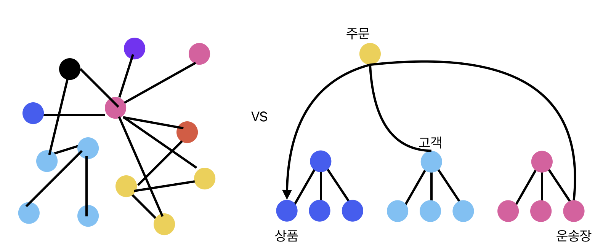

## 문제의식 

우리 팀은 개발과 배포 속도가 매우 좋았습니다.  
그래서 아키텍쳐에 대해 매우 만족하고 있었는데,  
어떤 요구사항들은 현재 시스템에 구현하기 어려웠습니다.  

회고해보면 그러한 요구사항에 맞는 기반이 되어 있지 않았고,  
모놀리스 구조에서 너무 쉽게 다른 클래스를 참조 할 수 있다보니  
참조 관계에 대해서 크게 중요하게 생각하지 않았던 것 같습니다.

특히 Django 는 Model 이 DB와 맵핑되고,  
Model 에 메소드를 추가하던지 Mixin 패턴을 사용하던지 쉽게 덩치가 커질 수 있습니다.  
그리고 데이터를 정규화 하다보면 서로 다른 도메인으로 볼 수 있는 모델들도 연결시키기 십상입니다.  
이러한 구조로 계속 개발을 하다보면 서로간의 참조 관계가 너무 심해져서 수정이 어려워지게 됩니다.  

그래서 데이터 구조든 클래스든 계층 구조로 만들어야 합니다.  
모놀리스 구조에서는 의식적으로 분리하지 않으면 복잡한 메쉬 형태의 참조가 발생합니다.  
MSA는 자연스럽게 서비스를(도메인) 분리하긴 하니까 이러한 문제가 해결 되기를 기대 하며 선택 할 것입니다.  
그러나 MSA라고 해서 이런일이 발생하지 않는 다는 보장은 없을 것입니다.  
~~마치 C++ 로 개발한다고 해서 객체지향이 아닐 수도 있는 것처럼요.  ~~

왼쪽은 여러 도메인들이 서로 복잡하게 참조하고 하여 메쉬 형태가 됨을 표현하였습니다.  
오른쪽은 각 도메인들의 구조가 계층적이고 Aggregator 는 하위 도메인을 참조함으로 계층을 유지하고 있음을 표현하였습니다.

## 쉽게 빠질 수 있는 함정

- 서비스를 작게 나누었어도 서비스 안에서 참조 구조를 염두에 두지 않으면 복잡도가 증가하는건 마찬가지  
- 모든 구조는 한 방향으로 흐르고 메쉬형이 아닌 계층적 구조가 되게 해야 함

