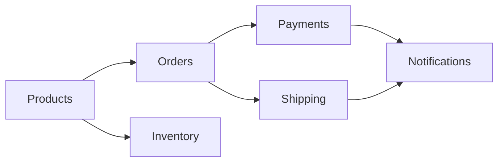
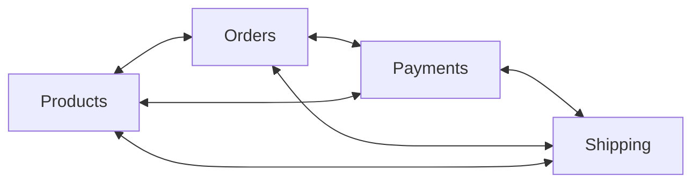
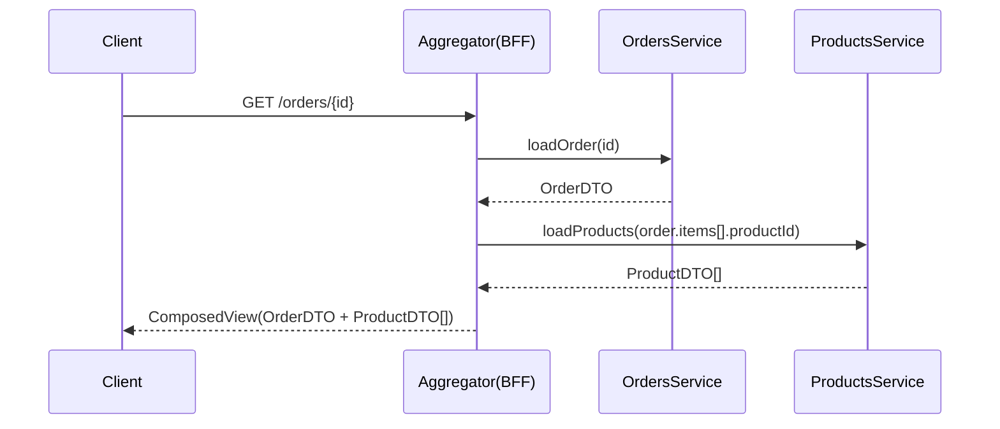
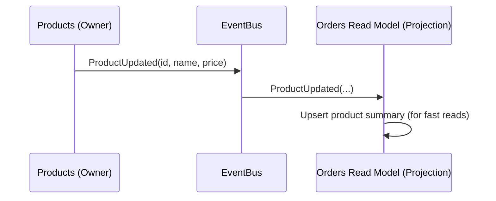

높은 코드 품질을 위한 기준으로는 재사용성, 유지보수성, 확장성 등이 있다.  
그러나 모놀리식 구조에서는 스파게티 구조가 되기 쉽다.  
로직에서만 발생하는 문제가 아니라 데이터 구조도 복잡한 그물망 형태가 되지 않도록 해야하는데 소흘해지기 쉽기 때문이다.  
일반적으로 사용하는 RDBMS 에서는 데이터간 관계를 맺는게 나쁜 일이 아니기 때문이다.  

1) 모놀리식 스파게티의 문제

높은 결합도: 하나의 변경이 연쇄적으로 다른 부분에 영향.

성능 개선 난항: 읽기 전용 DB/리플리카 도입, 쿼리 최적화, 부분 확장이 어렵다.

빅 볼 오브 머드(Big Ball of Mud): 모듈 경계 불명확, 모든 모듈이 모든 것을 참조, DB 전체 공유.

핵심 원인: 모듈/도메인 경계 부재 + 양방향/순환 의존 + DB 레벨 직접 결합.

2) 해결 방향: 계층형 데이터 구조와 비순환 의존

DAG(Directed Acyclic Graph) 원칙: 의존성이 한 방향으로만 흐르도록 설계 (사이클 금지).

DDD의 Bounded Context: 각 컨텍스트는 자기 데이터의 소유권과 일관성을 보장. 타 컨텍스트는 ID/DTO로 간접 참조.

DB 레벨 결합 최소화: 타 모듈 테이블에 대한 FK/조인 지양, 필요 시 식별자만 저장.

✔️ 도메인 A는 도메인 B를 직접 모델/조인하지 않는다. 필요 데이터는 Aggregator 또는 퍼사드(Service API) 를 통해 획득.

3) Aggregator 패턴 (조합 서비스)

서로 다른 도메인의 데이터를 조합해야 할 때, 중립적인 Aggregator가 데이터를 모아 응답/뷰를 생성한다.

중간 테이블/조합 서비스: 여러 도메인의 데이터를 묶어 제공.

데이터 중복 허용(읽기 최적화): 타 모듈 데이터의 요약본/스냅샷을 자체 보관.

이벤트 기반 동기화: 원본 변경 시 이벤트 발행 → 구독측이 프로젝션(읽기 모델) 갱신.

운영 트랜잭션 DB는 경계 내에서 단순화, 통합 조회/리포팅은 별도 읽기 모델/리포팅 DB로 분리 가능.

4) 모노레포에서 경계 유지하기

모노레포는 쉽게 경계를 무시하기 좋은 환경. 따라서 팀 규칙/도구로 강제한다.

❌ 안티패턴: View/Service에서 타 앱의 모델 import 후 직접 ORM 조인.

✅ 권장: 각 모듈이 Public API(퍼사드) 를 제공, 다른 모듈은 API/DTO로만 접근.

⛔ 내부 REST 호출 지양: 같은 프로세스에서 자기 REST를 호출하면 지연/오류/복잡도만 늘어난다 → 내부는 메서드 호출로 캡슐화.

5) Django 예시

5.1 퍼사드(Service)로 노출

```python
# products/services.py
from .models import Product

def get_product_info(product_id: int):
    p = Product.objects.get(pk=product_id)
    return {"id": p.id, "name": p.name, "price": p.price}

# orders/usecases.py
from products.services import get_product_info

def create_order(user_id: int, product_id: int, qty: int):
    prod = get_product_info(product_id)
    # 주문 레코드에 이름/가격 스냅샷 저장(읽기 최적화)
    # Order.objects.create(user_id=user_id, product_id=prod["id"],
    #                      product_name=prod["name"], unit_price=prod["price"], qty=qty)
    ...
```

5.2 이벤트로 읽기 모델 갱신(예시 아이디어)

```python
# products/signals.py
from django.dispatch import Signal
product_updated = Signal()  # args: id, name, price

# products/domain.py (변경 시 신호 발행)
product_updated.send(sender=None, id=p.id, name=p.name, price=p.price)

# orders/receivers.py
from products.signals import product_updated

@receiver(product_updated)
def on_product_updated(sender, **kwargs):
    # Orders 읽기 테이블(프로젝션)에 상품 요약 업서트
    # OrderItemSummary.upsert(product_id=kwargs['id'], name=kwargs['name'], price=kwargs['price'])
    ...
```

6) Spring 예시

6.1 서비스 인터페이스(퍼사드)
```java
// product/application/ProductService.java
public interface ProductService {
    ProductDto getProductInfo(Long id);
}

// order/application/OrderService.java
@Service
@RequiredArgsConstructor
public class OrderService {
    private final ProductService productService; // 내부 메서드 호출(동일 프로세스)

    public void createOrder(Long userId, Long productId, int qty) {
        ProductDto prod = productService.getProductInfo(productId);
        // 스냅샷 저장 후 주문 생성
    }
}
```

6.2 이벤트 기반 프로젝션

```java
// product/domain/event/ProductUpdated.java
public record ProductUpdated(Long id, String name, BigDecimal price) {}

// product/application/ProductFacade.java
publisher.publishEvent(new ProductUpdated(p.getId(), p.getName(), p.getPrice()));

// order/readmodel/ProductProjectionHandler.java
@EventListener
public void on(ProductUpdated e) {
    // 읽기 모델(프로젝션) 업서트
}
```

7) 팀/조직 관점: 코드 소유권과 리뷰

모듈 단위 소유권: 모듈은 이상적으로 단일 팀이 책임.

리뷰 규칙: 타 모듈 내부 구현/테이블 접근 금지. 퍼사드/DTO만 사용.

의존성 스캔/테스트: 순환 의존 탐지, 금지 import 룰, 아키텍처 테스트(ArchUnit 등) 활용.

8) 실천 체크리스트

의존성은 단방향(DAG) 으로 유지 (사이클 금지).

모듈별 데이터 소유권 확립: 타 모듈 데이터 직접 수정/조인 금지.

통신은 퍼사드 API/이벤트로만. 내부 REST 호출은 지양.

자주 조회되는 교차 데이터는 프로젝션/스냅샷으로 중복 저장.

리포팅/통합 조회는 별도 읽기 DB/뷰로 분리.

아키텍처 룰을 CI·리뷰·테스트로 강제.

9) 다이어그램 (Mermaid + ASCII 대체)

9.1 도메인 의존성 DAG



ASCII

Products --> Orders --> Payments --> Notifications
      \-> Inventory
Orders --> Shipping --> Notifications
(역방향 화살표/사이클 없음: DAG)

9.2 안티패턴: 그물형(순환)



ASCII

Products <--> Orders <--> Payments <--> Shipping
    ^                                   |
    +-----------------------------------+
(사이클 존재: 결합도↑, 변경 영향도↑)

9.3 Aggregator(BFF) 동기 컴포지션(시퀀스)



ASCII

Client -> Aggregator(BFF)
Aggregator -> OrdersService : loadOrder(id)
Aggregator -> ProductsService: loadProducts(productIds)
Aggregator -> Client : composed view (Order + Product)

9.4 이벤트 기반 읽기 모델(프로젝션)



ASCII

Products --(ProductUpdated)--> EventBus --> Orders Read Model
Orders Read Model : Product 요약/가격 등 프로젝션 갱신

9.5 모듈러 모놀리스: 경계 + 퍼사드

```meraid
graph TB
  subgraph Monolith Process
    subgraph Products Module
      PSvc[ProductService (Public API)]
      PRepo[(ProductRepository)]
    end

    subgraph Orders Module
      OSvc[OrderService (Public API)]
      ORepo[(OrderRepository)]
    end

    UI[Web/Controller/View] --> OSvc
    OSvc --> ORepo
    OSvc --> PSvc
    PSvc --> PRepo
  end
```

ASCII

[UI/Controller] -> OrderService(API) -> OrderRepository
                         |
                         v
                 ProductService(API) -> ProductRepository
(다른 모듈 Repo/엔티티 직접 접근 금지, Public API만 사용)

10) 태그/키워드

#모놀리식 #아키텍처 #Django #Spring #Aggregator #ModularMonolith #DDD #DAG #BoundedContext #Projection #BFF

11) 참고 자료(레퍼런스)

- Robert C. Martin, Acyclic Dependencies Principle
- Domain-Driven Design, Bounded Context / Aggregate / Context Mapping
- Kamil Grzybek, Modular Monolith Architecture (blog series)
- Simon Brown, Modular Monoliths (GOTO 2018)
- Derek Comartin, Long live the Monolith!
- 사례 글/토론: "Modular Monolith DB relations", "Method Calls vs Event-Driven in a Modular Monolith"

요약: 모놀리스에서는 특히 경계/의존성/데이터 소유권 원칙을 지켜 스파게티를 피해야 한다. 퍼사드/이벤트/프로젝션으로 도메인 조합을 관리하고, 내부 REST 호출은 지양하라. 점진적으로 경계를 강화하고 팀 소유권과 리뷰로 룰을 체화하라.

by GPT-5