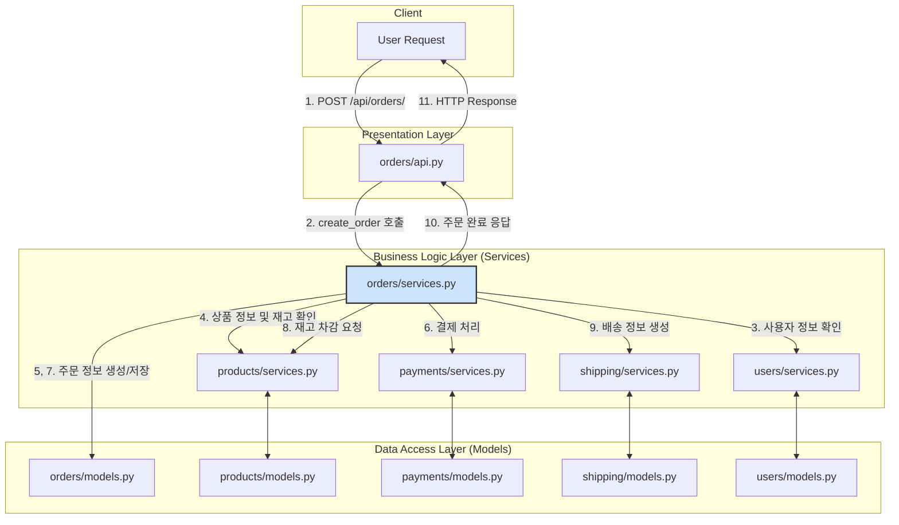

Django, DRF 를 이용해서 백엔드 개발을 장기간 했다. 응집성 있게 원칙에 맞춰서 개발을 잘 해왔다고 생각했는데, 부분에서 데이터 구조가 복잡해져 데이터 삭제, 변경이 어려워지고 비즈니스 로직 구현도 어려움을 느끼는 경험을 했다. FastAPI, Spring, DDD 등에 관한 글을 읽으면서 Python으로 개발한 부분은 원칙에 크게 벗어나지 않았지만 데이터가 그물형으로 매우 복잡하게 얽혀있다는 것을 깨닫게 되었다. 

DRF가 나쁜것은 아니다. 하지만 DRF를 사용하면 queryset 사용이 기본이고, View와 Data 가 엮이게 되기 때문에 아키텍처가 복잡해지기 쉽다. 물론 못하는건 아니지만, 다른 대안이 있나 찾아보게 되었고, Django-Ninja가 수년간 개발되며 성숙된 것을 발견했다. FastAPI 가 DDD, Facade, DTO 구조 구현이 자연스러운데 Django 의 편리한 ORM을 사용할 수 있는 Django-Ninja가 DRF를 대신할 수 있는 대안으로 보인다.

* [Django-Ninja](https://django-ninja.dev/tutorial/)

이러한 구상과 조사한 것을 프롬프트에 입력하여 Gemini Pro 2.5 의 딥 리서치 기능을 통해서 문서를 작성했다.

## **제 1부: 아키텍처 원칙의 필요성: 계층형 모델의 타당성 검증**

### **1.1 서론: 모놀리식 애플리케이션의 유지보수 위기**

소프트웨어 개발 프로젝트, 특히 모놀리식 애플리케이션은 초기 단계에서는 빠른 속도로 기능이 추가되며 성장한다. 그러나 시간이 흐르고 비즈니스 로직이 복잡해짐에 따라 많은 프로젝트가 '소프트웨어 엔트로피'의 증가라는 피할 수 없는 문제에 직면한다. 초기의 빠른 개발 속도를 위해 선택했던 아키텍처적 결정들이 점차 기술 부채로 쌓이면서, 시스템의 복잡도는 기하급수적으로 증가하고 변화에 대한 저항성은 극도로 높아진다. 새로운 기능을 추가하거나 기존 기능을 수정하는 작업은 예측 불가능한 부작용을 낳을 위험이 커지고, 개발 속도는 현저히 저하되는 장기적 침체기에 빠지게 된다.

이러한 현상은 우연이 아닌, 아키텍처 설계의 부재 혹은 잘못된 선택에서 비롯된 필연적인 결과이다. 특히, 프레임워크가 제공하는 '편의성'에 의존하여 아키텍처에 대한 깊은 고민 없이 개발을 진행할 경우, 구성 요소 간의 의존성이 거미줄처럼 얽히는 구조가 형성되기 쉽다. 이는 변경 사항이 발생했을 때 파급 효과를 예측하기 어렵게 만들며, 결국 시스템 전체의 유지보수성을 파괴하는 주된 원인이 된다.

따라서 복잡하고 긴 생명주기를 가진 시스템을 성공적으로 운영하기 위해서는, 초기 개발 속도만큼이나 장기적인 유지보수성을 담보할 수 있는 견고한 아키텍처를 구축하는 것이 무엇보다 중요하다. 이는 단순히 코드를 정리하는 수준을 넘어, 시스템의 엔트로피 증가를 억제하고 기술 부채를 체계적으로 관리하는 핵심 전략이다. 복잡한 기능을 추가하기 전에 기존 코드를 단순화하고 명확하게 리팩토링하는 것이 장기적으로 개발 효율성을 높이는 것과 마찬가지로 1, 프로젝트 초기부터 올바른 아키텍처 원칙을 적용하는 것은 지속 가능한 소프트웨어를 위한 가장 근본적인 투자이다. 본 보고서의 첫 번째 파트에서는 이러한 문제의식을 바탕으로, 유지보수 가능한 소프트웨어를 위한 핵심 원칙으로서 계층형 아키텍처의 타당성을 심도 있게 검증하고자 한다.

### **1.2 두 가지 아키텍처 이야기: 조직화된 계층 구조와 얽혀있는 메시 구조**

소프트웨어 아키텍처를 논할 때, 시스템의 유지보수성과 확장성을 결정짓는 두 가지 대조적인 구조, 즉 '계층형(Hierarchical)' 구조와 '메시(Mesh)' 구조를 통해 그 차이를 명확히 이해할 수 있다. 사용자가 제기한 문제의식은 바로 이 두 구조의 근본적인 차이에서 비롯된다.

#### **1.2.1 계층형(Hierarchical) 아키텍처: 질서와 예측 가능성**

계층형 아키텍처는 소프트웨어의 구성 요소를 관심사(Concern)에 따라 논리적인 계층으로 분리하고, 각 계층이 명확한 책임을 갖도록 설계하는 구조이다. 전형적으로 프레젠테이션 계층(Presentation Layer), 비즈니스 계층(Business Layer), 데이터 접근 계층(Data Access Layer)으로 구성되며, 의존성의 흐름이 상위 계층에서 하위 계층으로 향하는 단방향으로 제어된다. 예를 들어, 프레젠테이션 계층은 비즈니스 계층에 의존할 수 있지만, 비즈니스 계층은 프레젠테ATION 계층의 존재를 알지 못한다.2

이러한 구조의 핵심적인 장점은 각 계층 간의 결합도(Coupling)를 낮추는 데 있다. 낮은 결합도는 특정 계층의 내부 구현이 변경되더라도 다른 계층에 미치는 영향을 최소화한다. 이는 시스템의 특정 부분을 수정하거나 새로운 기술 스택으로 교체할 때, 전체 시스템에 미치는 파급 효과를 예측하고 제어하기 용이하게 만든다.2 결과적으로 코드의 가독성이 향상되고, 책임 소재가 명확해져 유지보수가 훨씬 수월해진다.

#### **1.2.2 메시(Mesh) 아키텍처: 혼돈과 예측 불가능성**

반면, 메시 아키텍처는 명확한 계층 구분 없이 구성 요소들이 서로 복잡하고 때로는 양방향으로 의존하는 구조를 의미한다. 이는 '스파게티 코드' 또는 '빅 볼 오브 머드(Big Ball of Mud)'라는 안티패턴으로 흔히 설명된다. 이러한 구조에서는 시스템의 어느 한 부분을 수정했을 때 그 영향이 어디까지 미칠지 예측하기가 매우 어렵다. 모든 구성 요소가 서로 얽혀있기 때문에, 작은 변경 하나가 예기치 않은 연쇄적인 버그를 유발할 수 있다.3

메시 구조는 처음부터 의도적으로 설계되는 경우는 드물다. 대부분은 아키텍처에 대한 고려 없이 개발 편의성만을 좇을 때 점진적으로 형성된다. 특히, 프레임워크가 제공하는 '편리한' 기능들이 이러한 구조를 부추기는 경우가 많다.

#### **1.2.3 '편의성의 함정(The Convenience Trap)'**

사용자가 지적한 Django REST Framework(DRF)의 queryset 직접 사용 문제는 바로 이 '편의성의 함정'을 보여주는 대표적인 사례이다. DRF의 ModelSerializer는 Django 모델과 queryset을 직접 사용하여 몇 줄의 코드만으로 CRUD API를 빠르게 생성할 수 있는 강력한 편의성을 제공한다. 그러나 이 편의성은 아키텍처적 대가를 치른다.

그 과정을 살펴보면 다음과 같다.

1. **경계의 붕괴:** API를 담당하는 뷰(View)와 시리얼라이저(Serializer)는 본질적으로 프레젠테이션 계층에 속한다. 이들이 다른 도메인(Django 앱)의 모델과 queryset을 직접 참조하고 조작하게 되면, 한 도메인의 프레젠테ATION 계층이 다른 도메인의 데이터 계층과 직접적인 의존 관계를 맺게 된다.  
2. **중간 계층의 부재:** 이 과정에서 비즈니스 로직을 처리하고 도메인 간의 상호작용을 제어해야 할 서비스 계층(Service Layer)이나, 데이터의 형태를 명확히 정의하는 데이터 전송 객체(DTO)와 같은 중간 계층이 생략된다.  
3. **메시 구조의 형성:** 이러한 패턴이 프로젝트 전반에 걸쳐 반복되면, 각 도메인의 뷰, 시리얼라이저, 모델들이 서로 직접적으로 얽히는 복잡한 의존성 망, 즉 메시 구조가 형성된다.

결론적으로, 초기 개발 속도를 높이기 위해 설계된 프레임워크의 '편의성'이 역설적으로 장기적인 아키텍처의 붕괴를 초래하는 주된 원인이 되는 것이다. 따라서 견고한 아키텍처를 구축하기 위해서는 프레임워크가 제시하는 가장 쉬운 길을 의심하고, 의식적으로 계층을 분리하고 의존성을 제어하려는 노력이 반드시 필요하다.

### **1.3 지속 가능한 설계의 기둥: 결합도와 응집도 심층 분석**

앞서 논의한 계층형 구조와 메시 구조의 차이를 기술적으로 뒷받침하는 핵심 원칙이 바로 결합도(Coupling)와 응집도(Cohesion)이다. 이 두 가지 개념은 소프트웨어 모듈의 품질을 측정하는 척도이자, 유지보수 가능한 시스템을 설계하는 데 있어 가장 근본적인 지침을 제공한다. 성공적인 아키텍처는 '낮은 결합도'와 '높은 응집도'를 지향한다.4

#### **1.3.1 낮은 결합도 (Loose Coupling)**

결합도는 한 모듈이 다른 모듈에 대해 얼마나 알고 있고, 의존하는지를 나타내는 척도이다. 낮은 결합도는 모듈 간의 상호 의존성을 최소화하는 것을 목표로 한다. 즉, 각 모듈이 독립적으로 존재하고 작동할 수 있도록 설계하는 것이다.

낮은 결합도가 가져오는 이점은 명확하다.

* **변경 용이성:** 한 모듈의 내부 로직이 변경되더라도, 그 모듈과 상호작용하는 다른 모듈에 미치는 영향을 최소화할 수 있다. 이로 인해 예상치 못한 버그 발생 가능성이 줄어들고, 시스템 수정이 안전해진다.6  
* **모듈 교체 및 확장성:** 특정 기능을 수행하는 모듈을 새로운 기술이나 개선된 로직을 가진 모듈로 교체하기가 용이하다. 이는 시스템의 유연성과 확장성을 크게 향상시킨다.2  
* **오류 격리:** 특정 모듈에서 오류가 발생했을 때, 그 문제가 다른 모듈로 전파되는 것을 막아준다. 이를 통해 오류의 원인을 파악하고 수정하는 과정이 단순해진다.7  
* **테스트 용이성:** 각 모듈을 독립적으로 테스트하기 쉬워진다. 의존성이 적기 때문에 테스트를 위한 환경 구성(Mocking, Stubbing)이 간단해진다.2

계층형 아키텍처는 본질적으로 각 계층이 명확한 인터페이스를 통해 통신하도록 강제함으로써 낮은 결합도를 유지하는 구조이다. 반면, 메시 구조는 높은 결합도의 전형적인 예시로, 시스템을 수정하거나 확장하는 것을 극도로 어렵게 만든다.

#### **1.3.2 높은 응집도 (High Cohesion)**

응집도는 하나의 모듈 내부에 존재하는 구성 요소들이 얼마나 연관되어 있고, 공통의 목적을 위해 긴밀하게 협력하는지를 나타내는 척도이다. 높은 응집도는 하나의 모듈이 단 하나의 명확한 책임과 역할을 갖는 것을 의미하며, 이는 객체 지향 설계의 단일 책임 원칙(Single Responsibility Principle, SRP)과 깊은 관련이 있다.4

높은 응집도를 가진 모듈은 다음과 같은 장점을 제공한다.

* **이해 용이성:** 모듈의 책임과 역할이 명확하기 때문에 코드를 분석하고 이해하기 쉽다. 개발자는 특정 기능을 찾기 위해 여러 모듈을 헤맬 필요 없이, 해당 책임을 가진 모듈만 살펴보면 된다.3  
* **재사용성 향상:** 모듈이 특정 기능에 집중하고 있기 때문에, 다른 시스템이나 프로젝트에서 해당 기능을 재사용하기가 용이하다. 이는 코드 중복을 줄이는 데 기여한다.6  
* **유지보수 용이성:** 관련된 기능들이 한곳에 모여있기 때문에, 기능 변경 시 수정해야 할 코드가 특정 모듈 내로 한정될 가능성이 높다. 이는 변경의 범위를 줄여 유지보수를 용이하게 한다.2

예를 들어, 비즈니스 로직을 처리하는 '서비스 계층'은 특정 도메인의 모든 비즈니스 규칙과 프로세스를 한곳에 모아 높은 응집도를 달성한다. 만약 이 로직이 뷰, 시리얼라이저 등 여러 곳에 흩어져 있다면, 이는 낮은 응집도의 상태이며 유지보수를 어렵게 만드는 원인이 된다.

#### **1.3.3 상호 보완적 관계**

낮은 결합도와 높은 응집도는 독립적인 개념이 아니라, 서로를 강화하는 상호 보완적인 관계에 있다. 모듈 내부의 응집도를 높여 하나의 명확한 책임을 갖도록 설계하면, 자연스럽게 다른 모듈에 대한 불필요한 의존성이 줄어들어 모듈 간의 결합도가 낮아진다.4 즉, '각자 자신의 일에만 집중하고, 다른 사람의 일에는 꼭 필요한 만큼만 관여한다'는 원칙이 소프트웨어 설계에도 동일하게 적용되는 것이다. 따라서 유지보수성이 뛰어난 시스템을 구축하려는 모든 노력은 결국 '높은 응집도'와 '낮은 결합도'를 달성하려는 과정으로 귀결된다.

### **1.4 전략적 경계 설정: 도메인 주도 설계(DDD)를 통한 복잡성 관리**

결합도와 응집도가 유지보수 가능한 소프트웨어를 위한 전술적 원칙이라면, 도메인 주도 설계(Domain-Driven Design, DDD)는 복잡한 시스템을 체계적으로 관리하기 위한 전략적 프레임워크를 제공한다. 특히 DDD의 핵심 개념인 '경계 컨텍스트(Bounded Context)'는 사용자가 추구하는 계층적이고 분리된 데이터 아키텍처를 구현하는 가장 강력한 도구이다.

#### **1.4.1 단일 통합 모델의 한계**

애플리케이션의 규모가 커지고 다양한 비즈니스 영역을 다루게 되면, 모든 영역에서 통용되는 단 하나의 통합된 데이터 모델을 유지하는 것은 거의 불가능해진다. 예를 들어, 전자상거래 시스템에서 '상품(Product)'이라는 용어는 각 부서의 관점에 따라 전혀 다른 의미와 데이터를 갖는다.10

* **판매팀**에게 '상품'은 가격, 할인 정보, 마케팅 문구가 중요하다.  
* **배송팀**에게 '상품'은 무게, 부피, 취급 주의사항이 중요하다.  
* **회계팀**에게 '상품'은 원가, 재고 자산 가치, 세금 코드가 중요하다.

이 모든 요구사항을 단일 Product 모델에 담으려고 시도하면, 모델은 극도로 비대해지고 복잡해지며, 한 부서의 요구사항 변경이 다른 모든 부서에 영향을 미치는 강한 결합이 발생한다. 이는 결국 모델의 일관성을 해치고 유지보수를 불가능하게 만든다.

#### **1.4.2 경계 컨텍스트(Bounded Context)를 통한 분리**

DDD는 이 문제에 대한 해답으로 '경계 컨텍스트'라는 개념을 제시한다. 경계 컨텍스트는 특정 도메인 모델이 일관성을 유지하고 유효하게 적용되는 명시적인 '경계'를 설정하는 것이다.10 각 경계 컨텍스트는 자신만의 독립적인 모델과 용어(Ubiquitous Language)를 가진다.13

위의 예시를 경계 컨텍스트로 분리하면 다음과 같다.

* **판매 컨텍스트:** Product 모델은 가격, 프로모션 정보 등을 포함한다.  
* **배송 컨텍스트:** ShippableItem 모델은 무게, 크기, 배송 정책 등을 포함한다.  
* **재고 컨텍스트:** InventoryItem 모델은 재고 수량, 창고 위치, 원가 등을 포함한다.

이렇게 컨텍스트를 분리함으로써 얻는 이점은 막대하다.

* **모델의 명확성 및 일관성:** 각 모델은 자신의 경계 내에서만 책임을 지므로, 작고 명확하며 일관성을 유지하기 쉽다.11  
* **독립적인 개발 및 유지보수:** 한 컨텍스트 내의 변경이 다른 컨텍스트에 미치는 영향을 최소화할 수 있다. 각 팀은 자신이 맡은 컨텍스트에만 집중하여 자율적으로 개발을 진행할 수 있다.11  
* **복잡성 관리:** 거대한 시스템을 이해하기 쉬운 작은 단위들로 분할하여 전체적인 복잡성을 효과적으로 관리할 수 있다.12

#### **1.4.3 컨텍스트 간의 통신**

경계 컨텍스트는 서로 완전히 고립된 섬이 아니다. 비즈니스 프로세스를 완수하기 위해 서로 통신해야 한다. 중요한 것은 이 통신이 모델을 직접 공유하는 방식이 아니라, 명확하게 정의된 인터페이스(API, 이벤트 메시지 등)를 통해 이루어진다는 점이다.11 예를 들어, '판매 컨텍스트'에서 주문이 완료되면, '주문 완료' 이벤트를 발행한다. '배송 컨텍스트'와 '재고 컨텍스트'는 이 이벤트를 구독하여 각각 배송 준비와 재고 차감이라는 자신들의 책임을 수행한다. 이처럼 컨텍스트 간의 관계는 '컨텍스트 맵(Context Map)'을 통해 명시적으로 정의되고 관리된다.10

이러한 접근 방식은 사용자가 원하는 "도메인 간에는 테이블 관계만 맺지 않고, 오직 정의된 인터페이스를 통해 통신하는" 아키텍처와 정확히 일치한다. 이는 도메인 간의 직접적인 결합을 원천적으로 차단하고, 통제된 상호작용만을 허용함으로써 메시 구조의 형성을 방지한다.

#### **1.4.4 모듈러 모놀리스와 마이크로서비스의 청사진**

흔히 경계 컨텍스트는 각 컨텍스트를 별도의 서비스로 배포하는 마이크로서비스 아키텍처(MSA)의 구현 단위로 알려져 있다.14 그러나 경계 컨텍스트의 진정한 가치는 물리적 배포 형태가 아닌, 논리적 설계 원칙에 있다. 즉, 단일 애플리케이션(모놀리스) 내에서도 각 Django 앱을 하나의 독립적인 경계 컨텍스트로 설계하고 구현하는 '모듈러 모놀리스(Modular Monolith)' 아키텍처를 구축하는 데 매우 효과적이다.

이러한 접근법은 다음과 같은 전략적 이점을 제공한다.

1. **논리적 분리:** 모놀리식 환경 내에서 각 Django 앱(도메인)은 독립적인 모델과 비즈니스 로직을 가지며, 다른 앱과는 오직 정의된 서비스 인터페이스를 통해서만 상호작용한다. 이는 마이크로서비스의 장점인 '느슨한 결합'과 '높은 응집도'를 모놀리식 환경에서 구현하는 것이다.  
2. **유지보수성 극대화:** 각 모듈(앱)이 독립적이므로, 특정 모듈의 수정이나 개선 작업이 다른 모듈에 미치는 영향을 최소화하여 전체 시스템의 유지보수성을 극대화할 수 있다.  
3. **마이크로서비스로의 점진적 전환:** 미래에 특정 도메인의 부하가 증가하거나 비즈니스적으로 분리가 필요할 경우, 이미 경계가 명확하게 정의되어 있기 때문에 해당 모듈(앱)을 별도의 마이크로서비스로 분리하는 작업이 훨씬 수월해진다. 즉, 모듈러 모놀리스는 미래의 아키텍처 변화에 유연하게 대응할 수 있는 전략적 발판이 된다.

결론적으로, 사용자가 지향하는 아키텍처는 단순히 '유지보수가 쉬운 구조'를 넘어, DDD의 전략적 원칙을 적용하여 장기적인 시스템의 성장과 변화에 대비하는 성숙한 엔지니어링 접근법이라 할 수 있다.

### **1.5 논제 검증: 명백한 지지**

지금까지의 분석을 종합하여, 사용자가 제기한 핵심 논제인 \*\*"데이터도 계층적으로 구성해야 유지보수가 쉽다. 메시형으로 복잡하게 데이터 구조가 얽히는 것은 좋은 것이 아니다"\*\*에 대한 최종적인 검증 결과를 제시한다.

이 논제는 단순한 개인의 의견이나 스타일의 문제가 아니라, 수십 년간 축적된 소프트웨어 공학의 근본 원칙과 현대적인 아키텍처 사상에 의해 강력하게 지지되는 명백한 사실이다.

1. **이론적 근거:** '낮은 결합도'와 '높은 응집도'라는 소프트웨어 설계의 두 기둥은 모듈 간의 의존성을 최소화하고 모듈 내의 책임은 명확히 하는 것을 지향한다. 계층형 구조는 이러한 원칙을 체계적으로 구현하는 구조적 해법이며, 반대로 메시 구조는 이 원칙들을 정면으로 위배하여 시스템을 취약하게 만든다.  
2. **전략적 근거:** 도메인 주도 설계(DDD)의 '경계 컨텍스트' 개념은 복잡한 시스템을 관리 가능한 작은 단위로 분할하고, 이들 간의 상호작용을 명시적으로 제어함으로써 시스템 전체의 복잡성을 관리하는 전략적 접근법을 제공한다. 이는 데이터와 로직이 무분별하게 얽히는 것을 방지하고, 명확한 경계를 가진 계층적 구조를 구축하는 구체적인 방법론을 제시한다.  
3. **실질적 이점:** 계층적 구조는 코드의 가독성, 테스트 용이성, 변경 용이성, 확장성 등 소프트웨어의 장기적인 생명주기 전반에 걸쳐 실질적인 이점을 제공한다. 이는 개발팀의 생산성을 향상시키고, 비즈니스의 변화에 민첩하게 대응할 수 있는 기술적 토대가 된다.

결론적으로, 사용자의 논제는 전적으로 타당하며, 메시 구조의 함정을 인지하고 계층적, 분리된 아키텍처로 전환하려는 방향성은 매우 올바르고 전문적인 엔지니어링 결정이다. 이는 단기적인 개발 편의성을 희생하더라도 장기적인 시스템의 안정성과 지속 가능성을 확보하려는 성숙한 접근 방식이며, 성공적인 대규모 프로젝트가 반드시 따라야 할 원칙이다.

## **제 2부: 원칙에서 실천으로: Django-Ninja 도입을 위한 전략적 제언**

제 1부에서 계층형 아키텍처의 필요성과 타당성을 확립했다. 이제 논의의 초점을 '왜(Why)'에서 '어떻게(How)'로 전환하여, 이러한 아키텍처 철학을 Django 생태계 내에서 가장 효과적으로 구현할 수 있는 도구를 선택하는 문제로 나아간다.

### **2.1 서론: 철학을 강제하는 도구의 선택**

훌륭한 아키텍처는 단순히 개발자의 의지나 규율에만 의존해서는 안 된다. 가장 이상적인 상황은 사용하는 개발 도구나 프레임워크 자체가 좋은 아키텍처를 자연스럽게 유도하고, 나쁜 습관을 어렵게 만드는 것이다. 도구는 중립적이지 않다. 모든 도구는 그 안에 설계자의 철학을 담고 있으며, 개발자가 특정 방식으로 생각하고 코드를 작성하도록 이끈다.

따라서 Django REST Framework(DRF)와 django-ninja 사이의 선택은 단순히 기능 목록을 비교하는 것을 넘어, 두 프레임워크가 가진 근본적인 설계 철학과 그것이 프로젝트의 아키텍처에 미치는 영향을 비교하는 과정이어야 한다. 이 장에서는 django-ninja가 어떻게 계층형 아키텍처 구축이라는 목표에 더 부합하는 철학을 가지고 설계되었는지를 논증할 것이다.

### **2.2 Django 구현: 계층형 아키텍처의 실현**

프레임워크를 비교하기에 앞서, Django 환경에서 계층형 아키텍처를 구성하는 핵심 디자인 패턴들을 명확히 정의할 필요가 있다. 이 패턴들은 프레임워크와 무관하게 적용될 수 있는 일반적인 원칙이며, 우리가 도구를 평가하는 기준이 될 것이다.

#### **2.2.1 서비스 계층 (Service Layer)**

서비스 계층은 애플리케이션의 비즈니스 로직과 유스케이스를 캡슐화하는 핵심적인 역할을 수행한다. 이 계층은 프레젠테이션 계층(API 뷰)과 데이터/도메인 계층(Django 모델) 사이의 중재자 역할을 한다.1

* **역할과 책임:** 서비스는 특정 비즈니스 프로세스를 수행하는 데 필요한 모든 단계를 조정한다. 예를 들어, '주문 생성' 서비스는 재고 확인, 결제 처리, 주문 데이터 생성, 알림 발송 등 여러 모델과 외부 시스템에 걸친 작업을 조율할 수 있다.  
* **주요 이점:**  
  * **Thin Views:** API 뷰는 HTTP 요청을 받고 응답을 보내는 책임에만 집중하게 된다. 모든 비즈니스 로직은 서비스 계층으로 위임되므로 뷰 코드가 간결하고 명확해진다.18  
  * **로직 재사용성:** 서비스 계층에 캡슐화된 비즈니스 로직은 API 뷰뿐만 아니라, 관리자 명령(Management Commands), 비동기 작업(Celery Tasks) 등 다양한 애플리케이션 진입점(entry point)에서 쉽게 재사용될 수 있다.17  
  * **관심사 분리:** 웹 기술(HTTP, JSON)과 비즈니스 도메인 로직이 명확하게 분리된다.17

#### **2.2.2 데이터 전송 객체 (Data Transfer Objects, DTOs)**

DTO는 계층 간, 특히 프레젠테이션 계층과 서비스 계층 간에 데이터를 전달하기 위해 사용되는 단순한 데이터 구조 객체이다. DTO는 로직을 포함하지 않고 오직 데이터만을 담는 그릇 역할을 하며, 계층 간의 명시적인 데이터 계약(Data Contract)을 정의한다.1

* **역할과 책임:** API 뷰는 HTTP 요청에서 받은 데이터를 파싱하고 유효성을 검사한 후, 이를 DTO에 담아 서비스 계층에 전달한다. 서비스는 Django 모델이나 request 객체에 직접 의존하는 대신, 이 잘 정의된 DTO를 입력으로 받아 작업을 수행한다.  
* **주요 이점:**  
  * **결합도 감소:** 서비스 계층이 웹 계층의 구체적인 구현(예: request.POST)이나 데이터베이스 계층의 내부 구조(Django 모델 필드)에 직접적으로 의존하지 않게 된다. 서비스는 오직 DTO라는 안정적인 인터페이스에만 의존한다.20  
  * **명시적인 인터페이스:** DTO의 정의 자체가 서비스가 어떤 데이터를 필요로 하는지를 명확하게 보여주는 문서 역할을 한다.  
  * **데이터 은닉:** API 응답 시에도 모델의 모든 필드를 그대로 노출하는 대신, 필요한 데이터만 담은 DTO를 사용하여 응답함으로써 내부 데이터 구조를 외부에 숨길 수 있다.20

#### **2.2.3 파사드 패턴 (Facade Pattern)**

파사드 패턴은 복잡한 서브시스템에 대한 단순화된 인터페이스를 제공하는 디자인 패턴이다. 서비스 계층의 맥락에서, 하나의 '파사드 서비스'가 여러 개의 더 작은, 세분화된 서비스들의 조합을 감싸고 특정 유스케이스를 위한 단일 진입점을 제공할 수 있다. 이는 애플리케이션의 복잡성이 증가함에 따라 서비스 간의 상호작용을 체계적으로 관리하는 데 도움을 준다.

이 세 가지 패턴(서비스, DTO, 파사드)은 함께 작동하여 Django 애플리케이션 내에 견고하고 유지보수 가능한 계층형 아키텍처를 구축하는 근간을 이룬다.

### **2.3 편의성의 해부: Django REST Framework의 아키텍처적 트레이드오프**

Django REST Framework(DRF)는 Django 생태계에서 API 개발의 표준으로 자리 잡은 강력하고 성숙한 프레임워크이다. 그 성공의 배경에는 방대한 기능, 거대한 커뮤니티, 그리고 무엇보다 표준적인 CRUD API를 매우 높은 생산성으로 개발할 수 있다는 장점이 있다.22 그러나 이러한 강력한 편의성은 제 1부에서 논의한 '편의성의 함정'이라는 아키텍처적 트레이드오프를 내포하고 있다.

#### **2.3.1 DRF의 강점**

DRF의 가치를 먼저 인정하는 것이 중요하다. DRF는 인증, 권한, 페이지네이션, 스로틀링, 필터링 등 API 개발에 필요한 거의 모든 기능을 '배터리 포함(batteries-included)' 방식으로 제공한다. ViewSet과 Router를 사용하면 모델 하나에 대한 전체 CRUD 엔드포인트를 단 몇 줄의 코드로 생성할 수 있다. 이는 특히 프로젝트 초기나 프로토타이핑 단계에서 엄청난 개발 속도를 보장한다.

#### **2.3.2 아키텍처적 함정: ModelSerializer**

DRF가 메시 구조를 유발하는 핵심적인 원인은 ModelSerializer의 설계 철학에 있다. ModelSerializer는 그 이름에서 알 수 있듯이 데이터베이스 모델과 API 표현을 강하게 결합시킨다. 이 과정에서 여러 책임이 하나의 클래스에 집중되는 문제가 발생한다.

* **책임의 혼합:** ModelSerializer는 본질적으로 다음과 같은 여러 책임을 동시에 수행한다.  
  1. **직렬화(Serialization):** 모델 인스턴스를 JSON과 같은 데이터 형태로 변환한다.  
  2. **역직렬화(Deserialization):** 들어온 데이터를 파이썬 객체로 변환한다.  
  3. **유효성 검사(Validation):** 들어온 데이터가 유효한지 검사한다.  
  4. **데이터베이스 상호작용(Database Interaction):** .create(), .update() 메서드를 오버라이드하여 모델 인스턴스를 생성하고 수정하는 로직을 포함한다.17

이러한 설계는 단일 책임 원칙(SRP)을 위배하며, 시리얼라이저 클래스의 응집도를 낮춘다. 비즈니스 로직(예: 특정 조건에서만 객체를 생성하거나, 객체 생성 시 다른 서비스를 호출하는 로직)이 자연스럽게 시리얼라이저 내부에 위치하게 되면서, 시리얼라이저는 단순한 데이터 변환기를 넘어 비즈니스 로직의 일부를 담당하는 '뚱뚱한(fat)' 객체가 되어버린다.

* **강한 결합:** ModelSerializer와 중첩 시리얼라이저(nested serializers)를 사용하면 API의 데이터 구조가 데이터베이스 모델의 관계(ForeignKey, ManyToManyField)에 직접적으로 종속된다. 이는 데이터베이스 스키마의 변경이 필연적으로 API 응답 구조의 변경으로 이어지는 강한 결합을 만들어낸다. 이는 API를 사용하는 클라이언트에게 예기치 않은 변경을 강요할 수 있으며, API의 안정성을 해치는 요인이 된다.

#### **2.3.3 암묵적 로직과 추적의 어려움**

DRF의 ViewSet과 Router는 매우 편리하지만, 엔드포인트와 실행 로직을 '암묵적으로(implicitly)' 연결한다.27 예를 들어,

POST /users/ 요청이 UserViewSet의 create 메서드를 호출한다는 사실은 프레임워크의 규칙에 의해 결정될 뿐, 코드에 명시적으로 드러나지 않는다. 이는 간단한 CRUD에서는 문제가 되지 않지만, 복잡한 비즈니스 로직이 get_queryset, perform_create, 시리얼라이저의 메서드 등 여러 곳에 흩어져 있을 경우, 특정 요청이 어떤 코드를 통해 처리되는지 추적하기 어렵게 만든다.27

결론적으로, DRF는 그 자체로 나쁜 프레임워크가 아니다. 하지만 그 설계 철학과 핵심 기능들은 개발자가 의식적으로 노력하지 않으면 자연스럽게 API 계층과 데이터 계층이 강하게 결합된 메시 구조로 흘러가도록 유도한다.18 사용자가 경험한 문제는 DRF를 사용하는 많은 개발자들이 공통적으로 겪는 어려움이며, 이는 프레임워크의 근본적인 설계에서 비롯된 필연적인 결과이다.

### **2.4 Django-Ninja의 이점: 아키텍처적 의도를 위한 프레임워크**

django-ninja는 FastAPI에서 영감을 받아 만들어진, 현대적이고 성능이 뛰어난 Django용 API 프레임워크이다. django-ninja가 DRF에 대한 강력한 대안으로 떠오르는 이유는 단순히 속도가 빠르기 때문만이 아니다. 더 중요한 것은, 그 설계 철학이 개발자로 하여금 자연스럽게 분리되고 계층화된 아키텍처를 구축하도록 유도한다는 점이다.

#### **2.4.1 Pydantic의 일급 시민 대우: DTO로 가는 자연스러운 길**

django-ninja의 가장 큰 아키텍처적 장점은 데이터 유효성 검사 및 직렬화를 위해 Pydantic을 핵심 요소로 채택했다는 것이다.29

* **Pydantic 스키마 = 순수한 DTO:** django-ninja에서 API의 입력과 출력을 정의하는 Pydantic Schema는 그 자체로 완벽한 DTO이다. 이 스키마들은 타입 힌트를 기반으로 한 순수한 데이터 클래스로, Django ORM이나 비즈니스 로직으로부터 완전히 분리되어 있다.21  
* **로직의 강제적 분리:** DRF의 ModelSerializer와 결정적으로 다른 점은, Pydantic Schema에는 .create()나 .update()와 같은 데이터베이스 조작 메서드가 존재하지 않는다는 것이다. 이는 프레임워크 수준에서 데이터 정의(DTO)와 비즈니스 로직의 분리를 강제한다. 개발자는 객체를 생성하거나 수정하는 로직을 스키마가 아닌 다른 곳, 즉 서비스 계층에 위치시킬 수밖에 없게 된다.17 이것이 바로  
  django-ninja가 계층형 아키텍처를 유도하는 핵심적인 메커니즘이다.  
* **강력하고 유연한 스키마 정의:** django-ninja는 Django 모델로부터 스키마를 생성(ModelSchema)하거나, 중첩된 객체를 표현하고, 동적으로 스키마를 만드는 등 Pydantic의 강력한 기능들을 최대한 활용할 수 있는 다양한 방법을 제공한다.33

#### **2.4.2 단순성과 의존성 주입을 통한 결합도 감소**

* **명시적이고 간결한 뷰:** django-ninja의 API 엔드포인트는 데코레이터를 사용한 일반 파이썬 함수로 정의된다. 이는 ViewSet의 암묵적인 라우팅 방식보다 로직의 흐름이 훨씬 명시적이고 추적하기 쉽다.29  
* **의존성 주입(Dependency Injection, DI) 친화적 설계:** django-ninja의 설계는 FastAPI와 마찬가지로 의존성 주입 패턴과 매우 잘 어울린다.16 비록 코어 라이브러리에 DI 기능이 내장되어 있지는 않지만,  
  django-ninja-extra와 같은 확장을 통해 쉽게 도입할 수 있으며 42,  
  dependency-injector와 같은 서드파티 라이브러리를 사용하거나 수동으로 패턴을 구현하는 것도 매우 자연스럽다.16  
* **테스트 용이성 향상:** 의존성 주입을 사용하면 API 뷰 함수에 서비스 클래스의 인스턴스를 쉽게 주입할 수 있다. 이는 계층 간의 관계를 공식화하고, 테스트 시 실제 서비스 대신 모의(mock) 객체를 주입하여 단위 테스트를 매우 간단하게 만들어준다.44

#### **2.4.3 성능과 현대성이 이끄는 더 나은 설계**

django-ninja는 Pydantic의 빠른 데이터 처리와 비동기(async) 우선 설계를 바탕으로 DRF보다 월등한 성능을 보여준다.22 성능 자체가 아키텍처의 직접적인 목표는 아닐 수 있지만, 현대적이고 성능이 뛰어난 도구는 개발자가 프레임워크의 내부적인 복잡함이나 성능 저하를 걱정하는 대신, 비즈니스 로직과 깨끗한 코드 구조에 더 집중할 수 있도록 돕는다. 또한, 파이썬 표준 타입 힌트를 적극적으로 활용하는 방식은 코드의 가독성을 높이고, 별도의 문서 없이도 코드 자체가 인터페이스를 설명하게 만들어 '프레임워크의 마법'에 대한 의존도를 줄여준다.26

#### **아키텍처 철학 비교**

| 아키텍처적 관심사 | Django REST Framework (DRF) | Django-Ninja |
| :---- | :---- | :---- |
| **데이터 전송 (DTOs)** | Serializer 클래스가 유효성 검사, 직렬화, 비즈니스/모델 로직을 혼합하는 경향이 있음. 순수한 DTO로 사용하려면 개발자의 엄격한 규율이 필요함. | Pydantic Schema가 설계상 타입-세이프한 순수 DTO 계층을 제공하여, 데이터 계약과 로직을 자연스럽게 분리함. |
| **비즈니스 로직 위치** | ModelSerializer와 ViewSet의 편의성으로 인해 로직이 웹/API 계층(뷰/시리얼라이저)에 위치하기 쉬움. | 단순한 함수 기반 뷰와 로직이 없는 스키마가 비즈니스 로직을 별도의 서비스 계층으로 추출하도록 유도함. |
| **의존성 관리** | 내장된 DI 없음. 컴포넌트 간 강한 결합이 발생하기 쉬우며, 결합도를 낮추기 위해 수동 패턴 적용이 필요함. | FastAPI에서 영감을 받은 설계로 DI 패턴과 호환성이 높음. 서비스를 뷰에 주입하고 테스트 시 모킹하기 용이함. |
| **결합도 경향** | **높음.** 프레임워크가 제시하는 가장 쉬운 길이 API 계층과 ORM/데이터 계층을 직접적으로 결합시킴. | **낮음.** 설계 자체가 API 계층과 데이터 계층 사이에 서비스와 DTO라는 중간 계층을 두는 것을 장려함. |
| **개발 철학** | **설정보다 관례 (Convention over Configuration).** 매우 독자적인 방식을 가지며, 기능이 풍부하고 '배터리 포함' 방식.24 | **명시성과 단순성 (Explicitness and Simplicity).** 명확성, 성능, 개발자 제어를 위해 현대 파이썬 기능(타입 힌트)을 활용함.26 |

### **2.5 Django-Ninja를 활용한 분리된 Django API 청사진**

이론적인 논의를 구체화하기 위해, django-ninja를 사용하여 계층형 아키텍처를 구현하는 실제적인 청사진을 제시한다. 이는 사용자가 앞으로 프로젝트를 구성할 때 따를 수 있는 명확하고 반복 가능한 패턴이 될 것이다.

#### **2.5.1 파일 구조**

하나의 Django 앱(예: widgets) 내의 이상적인 파일 구조는 다음과 같다.

widgets/  
├── __init__.py  
├── admin.py  
├── apps.py  
├── models.py      # 데이터베이스 모델 정의  
├── schemas.py     # Pydantic DTOs (API 데이터 계약)  
├── services.py    # 비즈니스 로직  
├── api.py         # Django-Ninja API 엔드포인트 (뷰/컨트롤러)  
└── tests/

#### **2.5.2 구현 예시**

1.models.py (데이터 계층)  
표준적인 Django 모델을 정의한다.

```Python

# widgets/models.py  
from django.db import models

class Widget(models.Model):  
    name = models.CharField(max_length=100)  
    description = models.TextField(blank=True)  
    stock = models.PositiveIntegerField(default=0)  
    created_at = models.DateTimeField(auto_now_add=True)
```

2.schemas.py (DTO 계층)  
API의 입력(In)과 출력(Out)을 위한 Pydantic 스키마를 정의한다. 이 스키마들은 API의 공개적인 계약(public contract) 역할을 한다.32

```Python

# widgets/schemas.py  
from ninja import Schema  
from datetime import datetime

class WidgetIn(Schema):  
    name: str  
    description: str = None  
    stock: int

class WidgetOut(Schema):  
    id: int  
    name: str  
    description: str  
    stock: int  
    created_at: datetime
```

3. services.py (서비스 계층)  
비즈니스 로직을 포함하는 서비스 클래스를 정의한다. 이 서비스는 HTTP에 대해 전혀 알지 못하며, 오직 DTO를 입력받아 Django ORM과 상호작용한다.

```Python

# widgets/services.py  
from.models import Widget  
from.schemas import WidgetIn, WidgetOut

class WidgetService:  
    def create_widget(self, dto: WidgetIn) -> Widget:  
        # 여기에 복잡한 비즈니스 로직이 들어갈 수 있음  
        # (e.g., 재고 시스템 연동, 유효성 검사 등)  
        widget = Widget.objects.create(  
            name=dto.name,  
            description=dto.description,  
            stock=dto.stock  
        )  
        return widget

    def get_widget_by_id(self, widget_id: int) -> Widget:  
        return Widget.objects.get(id=widget_id)
```

4. api.py (프레젠테이션 계층)  
django-ninja 라우터를 정의하고 API 엔드포인트를 만든다. 엔드포인트 함수는 매우 간결하며, 오직 요청을 받고, 서비스를 호출하고, 응답을 반환하는 역할만 수행한다.

```Python

# widgets/api.py  
from typing import List  
from ninja import Router  
from.schemas import WidgetIn, WidgetOut  
from.services import WidgetService

router = Router()  
widget_service = WidgetService() # 실제로는 DI 컨테이너를 통해 주입하는 것이 이상적

@router.post("/", response=WidgetOut)  
def create_widget(request, payload: WidgetIn):  
    """  
    새로운 위젯을 생성합니다.  
    """  
    widget = widget_service.create_widget(payload)  
    return widget

@router.get("/{widget_id}", response=WidgetOut)  
def get_widget(request, widget_id: int):  
    """  
    특정 위젯의 정보를 조회합니다.  
    """  
    widget = widget_service.get_widget_by_id(widget_id)  
    return widget
```

이 청사진은 관심사의 분리 원칙을 명확하게 보여준다. 각 파일과 클래스는 단 하나의 책임만을 가지며, 의존성은 api.py -> services.py -> models.py 방향으로 흐른다. 이는 DRF의 ModelSerializer를 사용할 때 흔히 발생하는 책임의 혼합과 계층의 붕괴를 원천적으로 방지하는 구조이다.

### 2.6 Django-ninja 계층형 아키텍처 예제2

"사용자, 상품, 주문, 결제, 배송" 도메인을 포함하여, 여러 도메인이 어떻게 독립적으로 구성되고 서비스 계층을 통해 상호작용하는지를 보여주는 확장된 예제입니다. 이 구조는 모듈러 모놀리스(Modular Monolith) 아키텍처의 좋은 예시가 될 수 있습니다.

#### 2.6.1. 전체 파일 구조 (ASCII Tree) 🌳
프로젝트가 여러 개의 독립적인 Django 앱(도메인)으로 구성된 구조입니다. 각 앱은 자체적인 api, services, schemas, models를 가집니다.

```
project/
├── manage.py
├── project/
│   ├── __init__.py
│   ├── asgi.py
│   ├── settings.py
│   ├── urls.py  # 👈 최상위 URL 설정
│   └── wsgi.py
├── apps/
│   ├── __init__.py
│   ├── users/
│   │   ├── api.py
│   │   ├── models.py
│   │   ├── schemas.py
│   │   └── services.py
│   ├── products/
│   │   ├── api.py
│   │   ├── models.py
│   │   ├── schemas.py
│   │   └── services.py
│   ├── orders/
│   │   ├── api.py
│   │   ├── models.py
│   │   ├── schemas.py
│   │   └── services.py
│   ├── payments/
│   │   ├── api.py
│   │   ├── models.py
│   │   ├── schemas.py
│   │   └── services.py
│   └── shipping/
│       ├── api.py
│       ├── models.py
│       ├── schemas.py
│       └── services.py
```

#### 2.6.2.도메인 간 상호작용 다이어그램 (Mermaid.js) 📊

주문(Orders) 도메인이 중심이 되어 다른 도메인의 서비스를 호출하며 비즈니스 로직을 오케스트레이션하는 흐름을 보여줍니다. 중요한 점은 한 도메인의 서비스가 다른 도메인의 모델(DB)에 직접 접근하지 않고, 반드시 해당 도메인의 서비스를 통해서만 통신한다는 것입니다.



#### 2.6.3.예제 코드 🧑‍💻

##### 2.6.3.1 products 앱 (상품 도메인)

```python

# apps/products/models.py
from django.db import models

class Product(models.Model):
    name = models.CharField(max_length=100)
    description = models.TextField(blank=True)
    price = models.DecimalField(max_digits=10, decimal_places=2)
    stock = models.PositiveIntegerField(default=0)

    def __str__(self):
        return self.name
```

```python
# apps/products/services.py
from django.shortcuts import get_object_or_404
from .models import Product

class ProductService:
    def get_product_by_id(self, product_id: int) -> Product:
        return get_object_or_404(Product, id=product_id)

    def check_stock(self, product_id: int, quantity: int) -> bool:
        product = self.get_product_by_id(product_id)
        return product.stock >= quantity

    def decrease_stock(self, product_id: int, quantity: int):
        product = self.get_product_by_id(product_id)
        if product.stock < quantity:
            raise ValueError("재고가 부족합니다.")
        product.stock -= quantity
        product.save()
```

##### 2.6.3.2 payments 앱 (결제 도메인)

```python
#services.py (외부 PG사 연동 로직을 가정)

# apps/payments/services.py
from decimal import Decimal

class PaymentService:
    def process_payment(self, user_id: int, amount: Decimal, card_info: dict) -> str:
        """
        외부 결제 게이트웨이와 통신하여 결제를 처리합니다.
        성공 시 결제 트랜잭션 ID를 반환한다고 가정합니다.
        """
        print(f"{user_id} 사용자의 {amount}원 결제를 시도합니다...")
        # 여기에 실제 PG사 API 연동 코드가 들어갑니다.
        if not card_info: # 간단한 실패 시뮬레이션
            raise ValueError("카드 정보가 올바르지 않습니다.")
        
        print("결제 성공!")
        # 가상의 트랜잭션 ID 생성
        import uuid
        transaction_id = f"txn_{uuid.uuid4().hex}"
        return transaction_id
```

##### 2.6.3.3 orders 앱 (주문 도메인 - 오케스트레이터)

```python 

# apps/orders/models.py
from django.db import models
# Django의 User 모델을 사용하거나 users 앱의 Custom User 모델을 사용합니다.
from django.contrib.auth.models import User 

class Order(models.Model):
    class OrderStatus(models.TextChoices):
        PENDING = 'PENDING', 'Pending'
        COMPLETED = 'COMPLETED', 'Completed'
        CANCELED = 'CANCELED', 'Canceled'

    user = models.ForeignKey(User, on_delete=models.CASCADE)
    status = models.CharField(max_length=10, choices=OrderStatus.choices, default=OrderStatus.PENDING)
    total_price = models.DecimalField(max_digits=10, decimal_places=2)
    created_at = models.DateTimeField(auto_now_add=True)
    # 결제, 배송 정보 등은 각 도메인에서 관리하고 여기서는 ID만 참조할 수 있습니다.
    payment_transaction_id = models.CharField(max_length=100, blank=True, null=True)

class OrderItem(models.Model):
    order = models.ForeignKey(Order, related_name='items', on_delete=models.CASCADE)
    # Product 모델에 직접 ForeignKey를 거는 대신, 느슨한 결합을 위해 ID만 저장할 수도 있습니다.
    # 여기서는 일반적인 ForeignKey 방식을 사용하되, 로직은 서비스 계층을 통하도록 강제합니다.
    product_id = models.PositiveIntegerField()
    quantity = models.PositiveIntegerField()
    price = models.DecimalField(max_digits=10, decimal_places=2) # 주문 시점의 가격 (스냅샷)
```

```python
# apps/orders/schemas.py
from ninja import Schema
from typing import List
from datetime import datetime

class OrderItemIn(Schema):
    product_id: int
    quantity: int

class OrderIn(Schema):
    items: List[OrderItemIn]
    card_info: dict # 간소화를 위해 dict로 처리

class OrderItemOut(Schema):
    product_id: int
    quantity: int
    price: float

class OrderOut(Schema):
    id: int
    user_id: int
    status: str
    total_price: float
    created_at: datetime
    items: List[OrderItemOut]
    payment_transaction_id: str | None
```

services.py (핵심: 여러 서비스를 오케스트레이션)

```python
# apps/orders/services.py
from decimal import Decimal
from django.db import transaction
from .models import Order, OrderItem
from .schemas import OrderIn
from apps.products.services import ProductService
from apps.payments.services import PaymentService
# from apps.shipping.services import ShippingService
# from apps.users.services import UserService

class OrderService:
    def __init__(self):
        # 실제로는 의존성 주입(DI) 컨테이너를 사용하는 것이 좋습니다.
        self.product_service = ProductService()
        self.payment_service = PaymentService()
        # self.shipping_service = ShippingService()
        # self.user_service = UserService()

    @transaction.atomic
    def create_order(self, user_id: int, payload: OrderIn) -> Order:
        """
        주문 생성의 전체 비즈니스 로직을 담당합니다.
        1. 상품 정보 조회 및 재고 확인
        2. 총 가격 계산
        3. 결제 처리
        4. 주문 생성
        5. 재고 차감
        6. 배송 정보 생성 (생략)
        """
        # 1. 상품 정보 조회 및 재고 확인, 총 가격 계산
        total_price = Decimal(0)
        items_to_create = []
        for item_data in payload.items:
            product = self.product_service.get_product_by_id(item_data.product_id)
            if not self.product_service.check_stock(item_data.product_id, item_data.quantity):
                raise ValueError(f"상품 ID {item_data.product_id}의 재고가 부족합니다.")
            
            item_price = product.price * item_data.quantity
            total_price += item_price
            items_to_create.append({
                "product_id": product.id,
                "quantity": item_data.quantity,
                "price": product.price, # 주문 시점의 가격을 저장
            })

        # 2. 결제 처리
        transaction_id = self.payment_service.process_payment(
            user_id=user_id,
            amount=total_price,
            card_info=payload.card_info
        )

        # 3. 주문 및 주문 아이템 생성
        order = Order.objects.create(
            user_id=user_id,
            total_price=total_price,
            status=Order.OrderStatus.COMPLETED,
            payment_transaction_id=transaction_id
        )
        for item in items_to_create:
            OrderItem.objects.create(order=order, **item)

        # 4. 재고 차감
        for item_data in payload.items:
            self.product_service.decrease_stock(item_data.product_id, item_data.quantity)
        
        # 5. 배송 정보 생성 (생략)
        # self.shipping_service.create_shipment(order_id=order.id, ...)

        return order
```

api.py

```python
# apps/orders/api.py
from ninja import Router
from .schemas import OrderIn, OrderOut
from .services import OrderService

router = Router(tags=["Orders"])
order_service = OrderService()

@router.post("/", response=OrderOut)
def create_order(request, payload: OrderIn):
    """
    새로운 주문을 생성합니다.
    - 인증된 사용자의 ID는 request.auth 에서 가져온다고 가정합니다.
    """
    # user_id = request.auth.id 
    user_id = 1 # 예제를 위해 하드코딩
    order = order_service.create_order(user_id=user_id, payload=payload)
    return order
```

## **3 최종 권고: 비전과 도구의 일치**

본 보고서는 두 부분에 걸쳐 사용자의 아키텍처적 고찰을 검증하고, 이를 실현하기 위한 구체적인 기술 전략을 제시했다.

**결론은 명확하다.**

1. **논제의 타당성:** 제 1부에서 검증했듯이, 계층적이고 느슨하게 결합된 아키텍처가 복잡하게 얽힌 메시 구조보다 장기적인 유지보수성 측면에서 월등하다는 사용자의 논제는 전적으로 타당하다. 이는 소프트웨어 공학의 기본 원칙과 현대적인 설계 사상에 의해 뒷받침되는 전문가적 견해이다.  
2. **도구의 선택:** DRF는 강력하고 성숙한 프레임워크이지만, 그 편의성에 중점을 둔 설계 철학은 개발자를 의도치 않게 메시 구조로 이끄는 경향이 있다. DRF를 사용하여 계층형 아키텍처를 구축하는 것은 가능하지만, 이는 프레임워크의 자연스러운 흐름을 거스르는 상당한 노력과 규율을 요구한다.  
3. **최적의 대안:** 반면, django-ninja는 그 설계 철학 자체가 계층형 아키텍처와 완벽하게 부합한다. Pydantic을 통한 DTO 계층의 자연스러운 형성, 로직 없는 스키마로 인한 서비스 계층으로의 비즈니스 로직 위임 강제, 그리고 의존성 주입과 같은 현대적인 패턴과의 높은 호환성은 개발자가 의식적으로 노력하지 않아도 자연스럽게 더 나은 아키텍처를 구축하도록 유도한다.

따라서 django-ninja로의 전환은 단순히 새로운 도구를 채택하는 것을 넘어, **유지보수 가능한 시스템을 만들겠다는 아키텍처적 비전을 실현하기 위한 가장 전략적인 선택**이다. 이는 지속적인 경계와 규율을 요구하는 길 대신, 좋은 아키텍처를 구축하는 것이 가장 자연스럽고 쉬운 길이 되도록 개발 환경 자체를 바꾸는 결정이다. django-ninja는 사용자의 아키텍처적 목표를 달성하는 데 있어 가장 강력하고 철학적으로 일치하는 파트너가 될 것이다.

#### **참고 자료**

1. Refactoring Code: Layered Architecture | by David Christianto - Medium, 8월 24, 2025에 액세스, [https://medium.com/@david.christianto05/refactoring-code-layered-architecture-8f2422df4918](https://medium.com/@david.christianto05/refactoring-code-layered-architecture-8f2422df4918)  
2. 계층형 아키텍처 - 꾸준히 하나씩 - 티스토리, 8월 24, 2025에 액세스, [https://coldpresso.tistory.com/20](https://coldpresso.tistory.com/20)  
3. 결합도(Coupling)와 응집도(Cohesion) - 思考 뭉치 - 티스토리, 8월 24, 2025에 액세스, [https://bipark.tistory.com/127](https://bipark.tistory.com/127)  
4. 객체의 결합도와 응집도, 8월 24, 2025에 액세스, [https://systemdata.tistory.com/70](https://systemdata.tistory.com/70)  
5. 응집도와 결합도 - high cohesion loose coupling - 복세편살 개발라이프, 8월 24, 2025에 액세스, [https://www.leafcats.com/68](https://www.leafcats.com/68)  
6. 유지보수와 결합/응집의 관계 (OOP) - 타깃코더스, 8월 24, 2025에 액세스, [https://targetcoders.com/%EC%9D%91%EC%A7%91%EB%8F%84%EC%99%80-%EA%B2%B0%ED%95%A9%EB%8F%84/](https://targetcoders.com/%EC%9D%91%EC%A7%91%EB%8F%84%EC%99%80-%EA%B2%B0%ED%95%A9%EB%8F%84/)  
7. Django documentation, 8월 24, 2025에 액세스, [https://docs.djangoproject.com/](https://docs.djangoproject.com/)  
8. 객체의 결합도 & 응집도 의미와 단계 총정리 - Inpa Dev ‍ - 티스토리, 8월 24, 2025에 액세스, [https://inpa.tistory.com/entry/OOP-%F0%9F%92%A0-%EA%B0%9D%EC%B2%B4%EC%9D%98-%EA%B2%B0%ED%95%A9%EB%8F%84-%EC%9D%91%EC%A7%91%EB%8F%84-%EC%9D%98%EB%AF%B8%EC%99%80-%EB%8B%A8%EA%B3%84-%EC%9D%B4%ED%95%B4%ED%95%98%EA%B8%B0-%EC%89%BD%EA%B2%8C-%EC%A0%95%EB%A6%AC](https://inpa.tistory.com/entry/OOP-%F0%9F%92%A0-%EA%B0%9D%EC%B2%B4%EC%9D%98-%EA%B2%B0%ED%95%A9%EB%8F%84-%EC%9D%91%EC%A7%91%EB%8F%84-%EC%9D%98%EB%AF%B8%EC%99%80-%EB%8B%A8%EA%B3%84-%EC%9D%B4%ED%95%B4%ED%95%98%EA%B8%B0-%EC%89%BD%EA%B2%8C-%EC%A0%95%EB%A6%AC)  
9. 20180128 Loose Coupling & High Cohesion - Contact 1997 - 티스토리, 8월 24, 2025에 액세스, [https://pasudo123.tistory.com/31](https://pasudo123.tistory.com/31)  
10. \[DDD\] 바운디드 컨텍스트(bounded context) - 개념편 - 매일 꾸준히, 더 깊이 - 티스토리, 8월 24, 2025에 액세스, [https://engineer-mole.tistory.com/399](https://engineer-mole.tistory.com/399)  
11. 바운디드 컨텍스트(Bounded Context)의 이해와 가상 적용 사례, 8월 24, 2025에 액세스, [https://shin-e-dog.tistory.com/88](https://shin-e-dog.tistory.com/88)  
12. DDD - 에릭 에반스, (14장 모델의 무결성 유지), 8월 24, 2025에 액세스, [https://iron-jin.tistory.com/entry/DDD-%EC%97%90%EB%A6%AD-%EC%97%90%EB%B0%98%EC%8A%A4-%EB%AA%A8%EB%8D%B8%EC%9D%98-%EB%AC%B4%EA%B2%B0%EC%84%B1-%EC%9C%A0%EC%A7%80](https://iron-jin.tistory.com/entry/DDD-%EC%97%90%EB%A6%AD-%EC%97%90%EB%B0%98%EC%8A%A4-%EB%AA%A8%EB%8D%B8%EC%9D%98-%EB%AC%B4%EA%B2%B0%EC%84%B1-%EC%9C%A0%EC%A7%80)  
13. \[도메인 주도 설계 핵심\] DDD 요약 - 잊혀질 생각, 기록의 가치 - 티스토리, 8월 24, 2025에 액세스, [https://goldfishhead.tistory.com/84](https://goldfishhead.tistory.com/84)  
14. DDD - 바운디드 컨텍스트란 무엇인가 ?\! - Official-Dev. blog, 8월 24, 2025에 액세스, [https://jaehoney.tistory.com/252](https://jaehoney.tistory.com/252)  
15. 도메인 주도 설계(Domain Driven Design)란? - 생각하는 개발자 - 티스토리, 8월 24, 2025에 액세스, [https://com789.tistory.com/43](https://com789.tistory.com/43)  
16. Building Scalable and Easily Testable Django Backends: A Step-by-Step Guide | Medium, 8월 24, 2025에 액세스, [https://medium.com/@ogretenahmetcan/building-scalable-and-easily-testable-django-backends-a-step-by-step-guide-55e29a5ad231](https://medium.com/@ogretenahmetcan/building-scalable-and-easily-testable-django-backends-a-step-by-step-guide-55e29a5ad231)  
17. How to implement a service layer in Django \+ Rest Framework ..., 8월 24, 2025에 액세스, [https://breadcrumbscollector.tech/how-to-implement-a-service-layer-in-django-rest-framework/](https://breadcrumbscollector.tech/how-to-implement-a-service-layer-in-django-rest-framework/)  
18. Django rest framework design patterns - Reddit, 8월 24, 2025에 액세스, [https://www.reddit.com/r/django/comments/15oln5o/django_rest_framework_design_patterns/](https://www.reddit.com/r/django/comments/15oln5o/django_rest_framework_design_patterns/)  
19. Against service layers in Django - Reddit, 8월 24, 2025에 액세스, [https://www.reddit.com/r/django/comments/fjqvwc/against_service_layers_in_django/](https://www.reddit.com/r/django/comments/fjqvwc/against_service_layers_in_django/)  
20. Which layer is the correct place to convert Model to Dto? - Stack Overflow, 8월 24, 2025에 액세스, [https://stackoverflow.com/questions/73286402/which-layer-is-the-correct-place-to-convert-model-to-dto](https://stackoverflow.com/questions/73286402/which-layer-is-the-correct-place-to-convert-model-to-dto)  
21. Using pydantic for django db models - standard practice? - Reddit, 8월 24, 2025에 액세스, [https://www.reddit.com/r/django/comments/1awb8uk/using_pydantic_for_django_db_models_standard/](https://www.reddit.com/r/django/comments/1awb8uk/using_pydantic_for_django_db_models_standard/)  
22. Django 기반 API Framework: DRF vs Django-ninja | by gary ..., 8월 24, 2025에 액세스, [https://blog.toktokhan.dev/django-%EA%B8%B0%EB%B0%98-api-framework-drf-vs-django-ninja-25117006a1ef](https://blog.toktokhan.dev/django-%EA%B8%B0%EB%B0%98-api-framework-drf-vs-django-ninja-25117006a1ef)  
23. DRF: Django REST Framework 알아보기 | 블로그 - 모두의연구소, 8월 24, 2025에 액세스, [https://modulabs.co.kr/blog/about_drf](https://modulabs.co.kr/blog/about_drf)  
24. Django REST Framework: Pros and Cons - TestDriven.io, 8월 24, 2025에 액세스, [https://testdriven.io/blog/drf-pros-cons/](https://testdriven.io/blog/drf-pros-cons/)  
25. Django Rest Framework vs. Django Ninja: Choosing the Right Framework for Your API | by StartxLabs Technologies | Medium, 8월 24, 2025에 액세스, [https://medium.com/@StartXLabs/django-rest-framework-vs-django-ninja-choosing-the-right-framework-for-your-api-377bc925dcb6](https://medium.com/@StartXLabs/django-rest-framework-vs-django-ninja-choosing-the-right-framework-for-your-api-377bc925dcb6)  
26. Django Rest Framework vs. Django-Ninja: A High-Level Comparison | PullRequest Blog, 8월 24, 2025에 액세스, [https://www.pullrequest.com/blog/django-rest-framework-vs-django-ninja-a-high-level-comparison/](https://www.pullrequest.com/blog/django-rest-framework-vs-django-ninja-a-high-level-comparison/)  
27. Challenges Learning Django Rest Framework - Simple Thread, 8월 24, 2025에 액세스, [https://www.simplethread.com/challenges-learning-django-rest-framework/](https://www.simplethread.com/challenges-learning-django-rest-framework/)  
28. New API: DRF or django-ninja? - Reddit, 8월 24, 2025에 액세스, [https://www.reddit.com/r/django/comments/1ajmvyr/new_api_drf_or_djangoninja/](https://www.reddit.com/r/django/comments/1ajmvyr/new_api_drf_or_djangoninja/)  
29. Django Ninja, 8월 24, 2025에 액세스, [https://django-ninja.dev/](https://django-ninja.dev/)  
30. Django and Pydantic - TestDriven.io, 8월 24, 2025에 액세스, [https://testdriven.io/blog/django-and-pydantic/](https://testdriven.io/blog/django-and-pydantic/)  
31. Part 1: Django Ninja Is More Than Just a Fast API Framework — Here's What You're Missing, 8월 24, 2025에 액세스, [https://medium.com/django-unleashed/part-1-django-ninja-is-more-than-just-a-fast-api-framework-heres-what-you-re-missing-a28277b526d6](https://medium.com/django-unleashed/part-1-django-ninja-is-more-than-just-a-fast-api-framework-heres-what-you-re-missing-a28277b526d6)  
32. Example of using Data Transfer Objects with Django Ninja - GitHub, 8월 24, 2025에 액세스, [https://github.com/WHOIGit/django-ninja-dto-example](https://github.com/WHOIGit/django-ninja-dto-example)  
33. Defining a Schema - Django Ninja, 8월 24, 2025에 액세스, [https://django-ninja.dev/guides/response/](https://django-ninja.dev/guides/response/)  
34. Schema - Django Ninja Extra, 8월 24, 2025에 액세스, [https://eadwincode.github.io/django-ninja-extra/tutorial/schema/](https://eadwincode.github.io/django-ninja-extra/tutorial/schema/)  
35. Generating a Schema dynamically - Django Ninja, 8월 24, 2025에 액세스, [https://django-ninja.dev/guides/response/django-pydantic-create-schema/](https://django-ninja.dev/guides/response/django-pydantic-create-schema/)  
36. Pydantic Schema Nesting : r/learnpython - Reddit, 8월 24, 2025에 액세스, [https://www.reddit.com/r/learnpython/comments/10b7vqd/pydantic_schema_nesting/](https://www.reddit.com/r/learnpython/comments/10b7vqd/pydantic_schema_nesting/)  
37. Pydantic: pass the entire dataset to a nested field - Stack Overflow, 8월 24, 2025에 액세스, [https://stackoverflow.com/questions/77808226/pydantic-pass-the-entire-dataset-to-a-nested-field](https://stackoverflow.com/questions/77808226/pydantic-pass-the-entire-dataset-to-a-nested-field)  
38. Pydantic - Nested Models, JSON Schema and Auto-Generating Models with datamodel-code-generator - YouTube, 8월 24, 2025에 액세스, [https://m.youtube.com/watch?v=yD_oDTeObJY\&t=227s](https://m.youtube.com/watch?v=yD_oDTeObJY&t=227s)  
39. Generating a Schema from Django models, 8월 24, 2025에 액세스, [https://django-ninja.dev/guides/response/django-pydantic/](https://django-ninja.dev/guides/response/django-pydantic/)  
40. Django Ninja vs Django Rest Framework | by João Verdasca - Runtime Revolution, 8월 24, 2025에 액세스, [https://revs.runtime-revolution.com/django-ninja-vs-django-rest-framework-3af867393de1](https://revs.runtime-revolution.com/django-ninja-vs-django-rest-framework-3af867393de1)  
41. Combining FastAPI Dependency Injection with Service and Repository Layers - dotcs, 8월 24, 2025에 액세스, [https://blog.dotcs.me/posts/fastapi-dependency-injection-x-layers](https://blog.dotcs.me/posts/fastapi-dependency-injection-x-layers)  
42. Django Ninja Extra, 8월 24, 2025에 액세스, [https://eadwincode.github.io/django-ninja-extra/](https://eadwincode.github.io/django-ninja-extra/)  
43. Ninja \+ dependency injector? · Issue #1406 · vitalik/django-ninja - GitHub, 8월 24, 2025에 액세스, [https://github.com/vitalik/django-ninja/issues/1406](https://github.com/vitalik/django-ninja/issues/1406)  
44. Django example — Dependency Injector 4.48.1 documentation, 8월 24, 2025에 액세스, [https://python-dependency-injector.ets-labs.org/examples/django.html](https://python-dependency-injector.ets-labs.org/examples/django.html)  
45. What is the best way to inject dependencies in Django - Reddit, 8월 24, 2025에 액세스, [https://www.reddit.com/r/django/comments/1bi4p72/what_is_the_best_way_to_inject_dependencies_in/](https://www.reddit.com/r/django/comments/1bi4p72/what_is_the_best_way_to_inject_dependencies_in/)  
46. Dependency injection in Python | Snyk, 8월 24, 2025에 액세스, [https://snyk.io/blog/dependency-injection-python/](https://snyk.io/blog/dependency-injection-python/)  
47. Dependency injections in Django/Python - Reddit, 8월 24, 2025에 액세스, [https://www.reddit.com/r/django/comments/1g1johj/dependency_injections_in_djangopython/](https://www.reddit.com/r/django/comments/1g1johj/dependency_injections_in_djangopython/)  
48. Is this the right way to do dependency injection in Django? - Stack Overflow, 8월 24, 2025에 액세스, [https://stackoverflow.com/questions/56535304/is-this-the-right-way-to-do-dependency-injection-in-django](https://stackoverflow.com/questions/56535304/is-this-the-right-way-to-do-dependency-injection-in-django)

