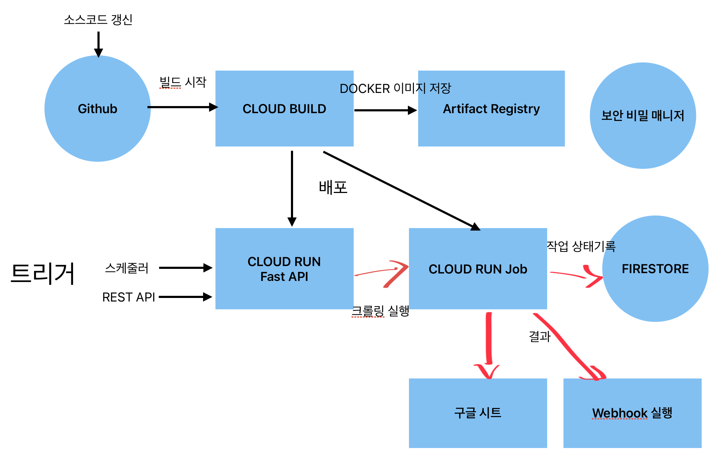

전자소송, 국선변호사 시스템 크롤링을 GCP 로 마이그레이션 한 경험을 남깁니다.

* 국선전담 변호사 시스템 : https://guksun.scourt.go.kr/
* 전자소송 시스템 : https://ecfs.scourt.go.kr/psp/index.on

[사법정보공유 포털](https://openapi.scourt.go.kr/kgso301m01.do)에서 OPEN API 를 제공하는 것이 있지만 아직 제한적이다.

기존 시스템은 윈도에서 관리자가 수동으로 크롤링을 트리거하는 방식이었다.  
개인 컴퓨터를 사용해야하는 불편함 때문에 클라우드로 이전 계획을 수립했다.  
사용하던 시스템이 구글 웍스와 엮여있어서 GCP 로 이전하는게 좋을 것 같았다.  

## 요건, 제약사항

* 크롤링 트리거 : 스케줄러, API 호출
* 크롤링 결과 : 구글 시트 저장. Webhook 호출
* 로그 : GCP Log, FirebaseStore
* 여러건을 크롤링하면 작업이 길어 질 수 있음.
  Cloud Run 이 적합하다고 생각했으나, Cloud Run 은 5분의 제약이 있어서 Cloud Run Job 으로 결정
* 기존 시스템은 selenium 으로 실행 화면을 직접 볼 수 있으나 GCP 에서는 볼 수 없으니 모두 확인하고 올려야함.
* 전자소송 시스템은 가상 키보드를 사용해서 자동 입력 방법이 필요함. 구글링하면 해법이 다수 검색됨.

## 시스템 구성

* Cloud Run : 서버 실행을 위한 컨테이너. FastAPI 를 사용.
* Cloud Run Job : 실제 크롤링이 수행되는 컨테이너.
* Cloud Build : CI/CD 를 위한 빌드. Github 과 연결됨.
* Artifact Registry : Docker 이미지 저장소.
* FirebaseStore : 로그 저장.
* Secret Manager : 각종 보안 정보 저장

## 후기

* 보안키보드와 알 수 없는 폼 규칙들 때문에 BeautifulSoup + Request 를 이용하지 못하여 작업이 좀 더 어려웠다.
* 전체 시스템 아키텍쳐를 구성하고 배포 스크립트까지 LLM 의 도움을 받아서 작성했는데, 권한 설정 관련된 부분을 LLM 이 완벽하게 수행하지 못하여 어려움을 겪었다. 결국 몇 부분에서는 수동으로 조작.
* Docker, Cloud Run, Cloud Run Job, Cloud Build, Artifact Registry, FirebaseStore, Secret Manager 등 GCP 에서 제공하는 서비스에 대해 더 깊은 이해를 할 수 있었다.

### 프로젝트의 의미

* 변호사들의 단순 사무 작업을 자동화 하여 데이터베이스 화 함.  
* 이러한 데이터는 추후 다른 자동화의 기반으로 사용 될 수 있음.