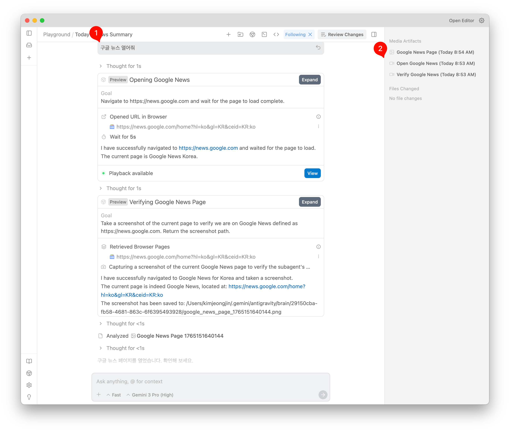
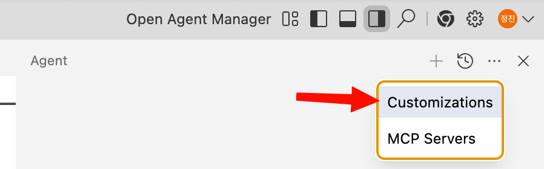
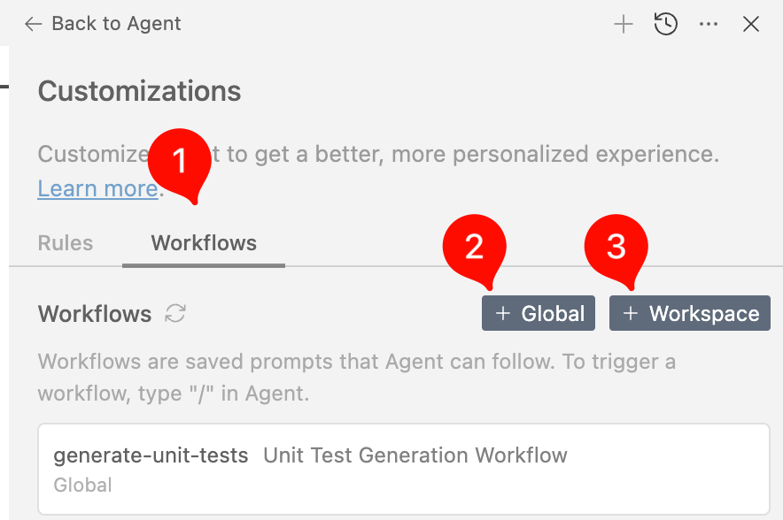
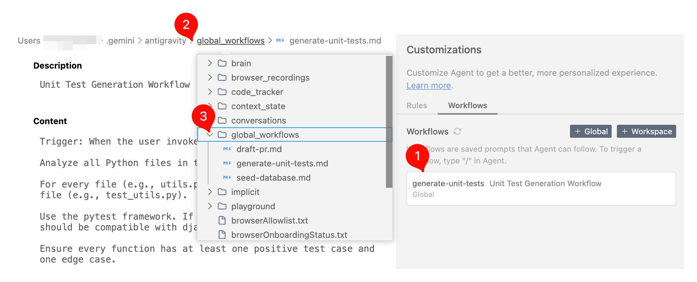
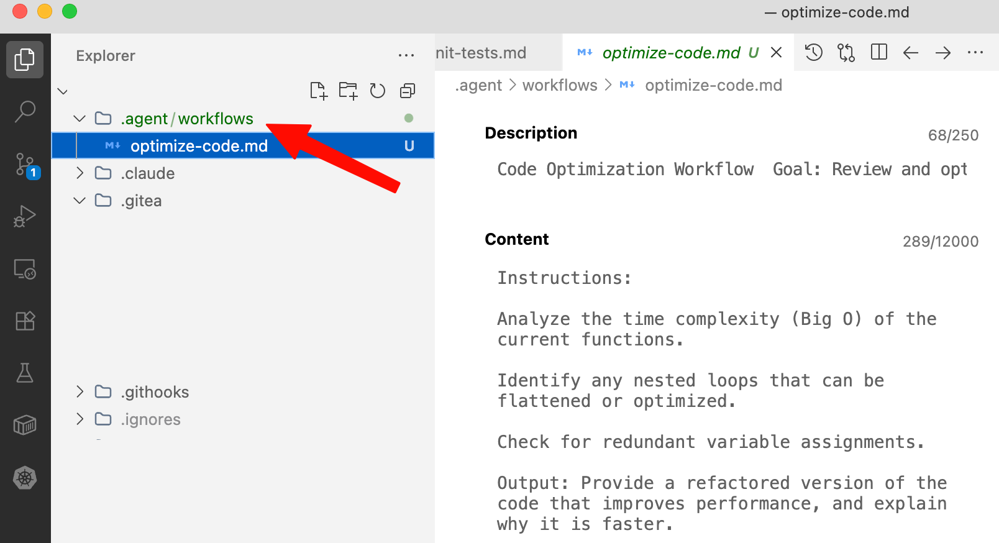

원문은 다음 아티클이고, 일반적인 사용법은 잘 알테니 몇가지 유용한 것만 추려봄.  

https://medium.com/google-cloud/tutorial-getting-started-with-google-antigravity-b5cc74c103c2

- Agent Manager Window
- Playground
- Workflows 사용자 정의 명령

## Agent Manager 단축키

Agent Manager 라고 칭하는 화면은 기본 화면에서 분리되어 동작한다.  
기본 화면과 포커스 토글은 **CMD+E** 로 한다.

기본적인 채팅을 위한 기능은 오른쪽 위의 버튼을 누르면 표시된다.


에이전트 매니저는 위에서 사용했던 채팅 세션으 Inbox 와 Workspaces 로 표시된다.  
Workspaces 를 통해서 한번에 여러 세션을 관리 할 수 있다.  


## Playground

Playground 는 웹 브라우저를 띄워서 채팅을 하며 작업을 할 수 있다.  
UI 프로토타이핑 뿐 아니라 기능 개발에도 적합하다.

  A playground is an independent workspace perfect for quick prototypes or following your curiosity. You can always move playgrounds into a new workspace to organize your work.



일반적인 채팅으로 시작한다.(예시 1번)  
크롬도 띄우고 크롬 확장까지 설치한다.  
특정 동작에서 Media Artifacts 가 생성된다.(예시 2번)  
Media Artifacts 는 어떤 동작을 하는지 화면 기록을 한다.  

예시는 웹 페이지 여는 것을 했는데, 웹 페이지를 열고 어떤 동작들(매크로, 크롤링)을 했다면 그것들을 코드로 생성 할 수 있다.  
그냥 간단하게 채팅창에 "코드로 만들어줘"라고 하면 됨.  

또는 실제 프로젝트 개발 서버를 Workspace에 열고 개발 서버를 통해 작업했다면 바로 코드에 반영도 가능하다.  

## Workflows 

  

오른쪽 상단 ... 버튼을 누르면 Customizaitons 메뉴가 나오고 Workflows 를 통해서 사용자 정의 명령을 만들 수 있다.  



1 Workflows 탭을 누르면 추가 가능하다.  

- Global, Workspace 범위로 설정 가능. 
  예를 들어 python unit test 를 만드는 workflow는 파이썬 workspace 적용는 식으로...

### Workflow 추가

원본 링크의 "Sample Workflows" 부터 몇가지 예제가 나와있는데 범용적으로 쓰기 좋은 예제이므로 추가하면 유용하게 쓸 수 있다.  


Global 또는 Workspace 둘 중 하나를 택하고, 이름을 적는다.  


그러면 화면처럼 설명과 컨텐츠로 나눠서 적을 수 있다.

```
Unit Test Generation Workflow
Trigger: When the user invokes this workflow. Instructions:
Analyze all Python files in the current active context.
For every file (e.g., utils.py), create a corresponding test file (e.g., test_utils.py).
Use the pytest framework.
Ensure every function has at least one positive test case and one edge case.
```

이런 예제가 있는데 Desciption 은 Instrctions 앞까지, Content 에는 나머지를 입력했다.  


### Workflow 수정

그런데, Anvigravity Version 1.11.14 에서 Workflows 목록이 다 나오지 않는다.
그래서 그런지 등록한 workflow를 사용 할 수 없다.  
개인설정 문제인지, 버그인지는 추후 업데이트 하겠습니다.  



그래서 지금은 첨부이미지처럼 순서를 따라가면 전역 Workflow 를 선택해서 수정 할 수 있다.

Workspace 한정 Workflow는 다음처럼 파일 탐색기에서 볼 수 있다.

